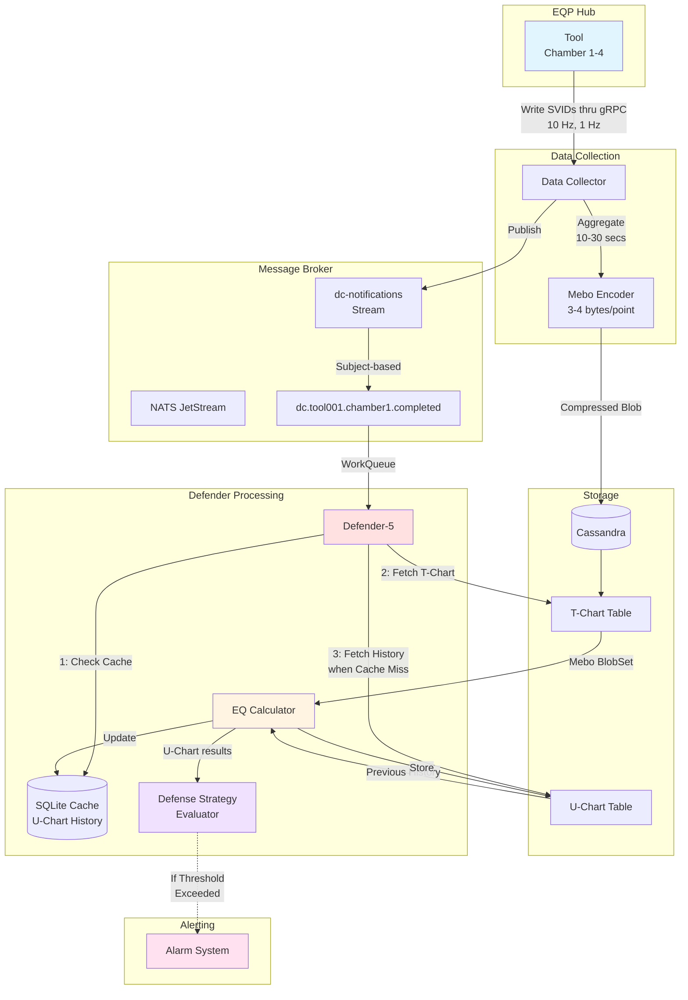
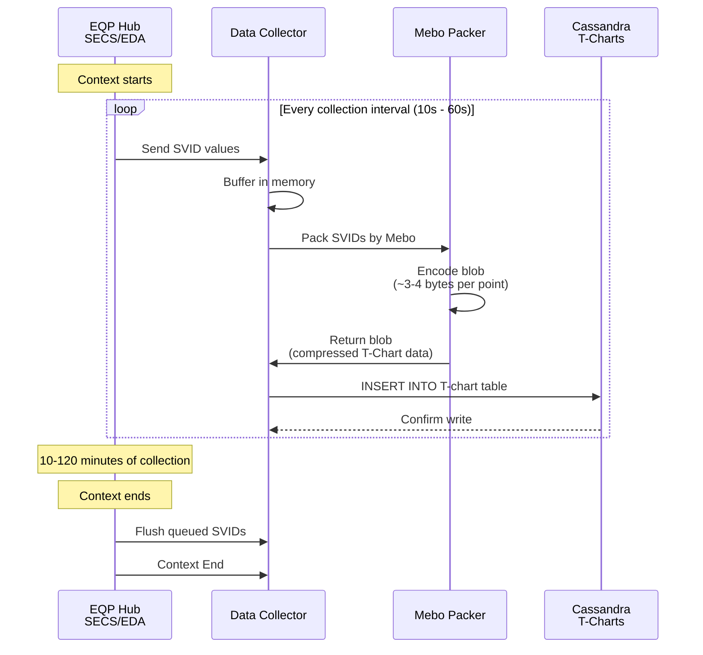
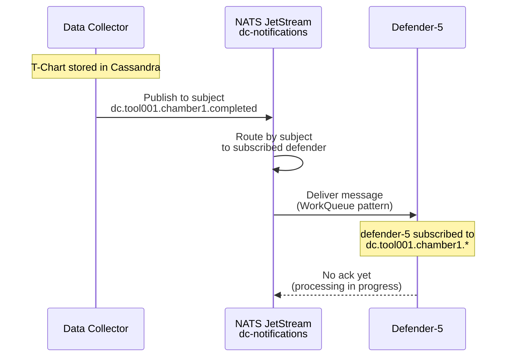
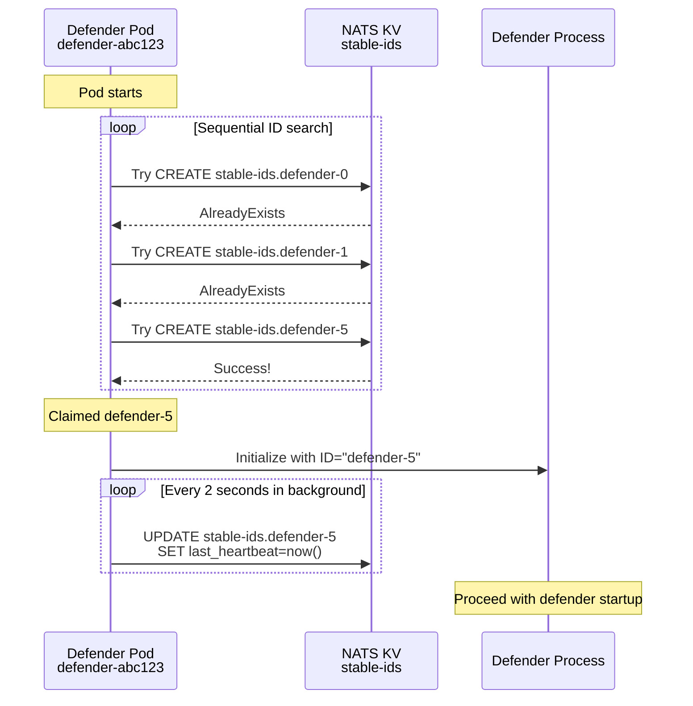
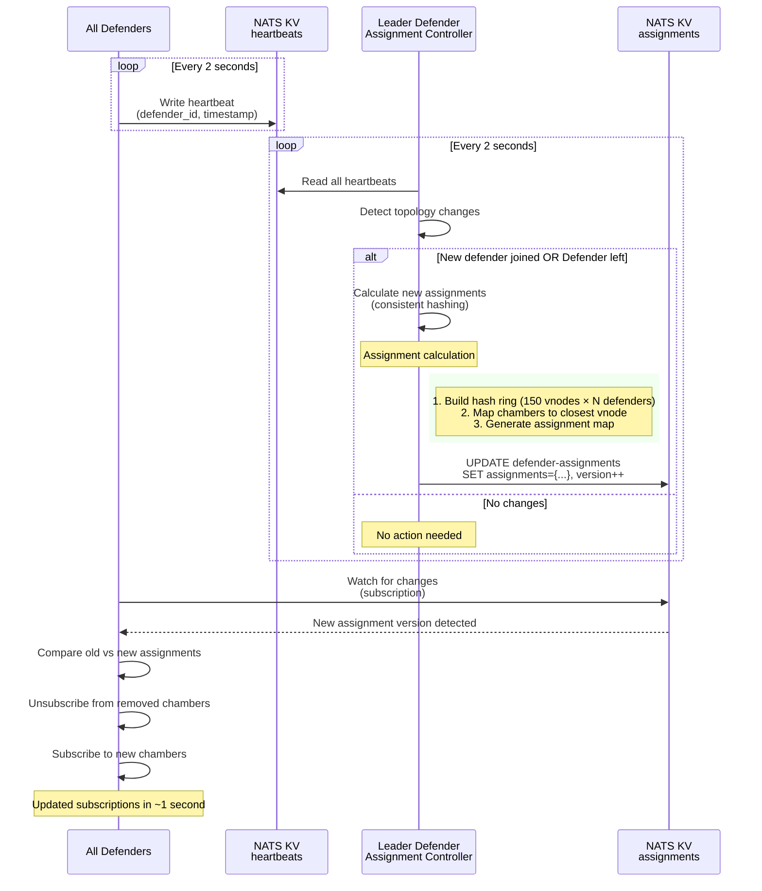
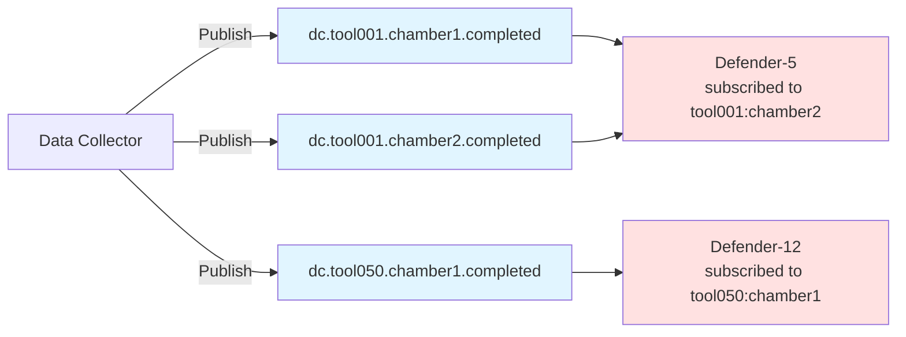
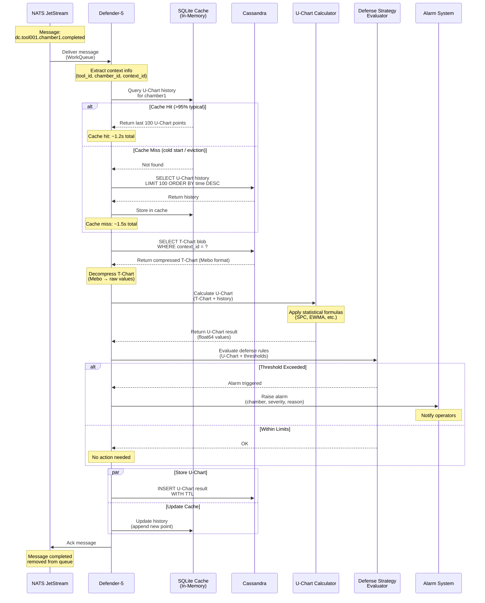
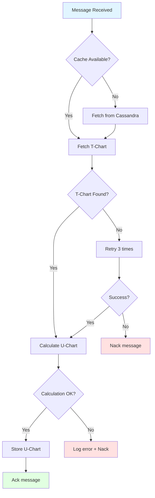

# Data Flow

## Overview

This document provides detailed data flows through the system, from equipment data collection to alarm generation, including all intermediate processing steps.

**Covered Flows**:
1. **SVID Collection and T-Chart Generation** - Equipment → Collector → Cassandra
2. **Completion Notification** - Collector → NATS → Defenders
3. **Stable ID Claiming** - Defender startup and ID pool management
4. **Assignment Map Updates** - Leader monitoring and assignment calculation
5. **Chamber Message Routing** - Subject-based routing to defenders
6. **U-Chart Processing** - End-to-end message handling with cache, calculation, and alarms

## End-to-End Data Flow



## Detailed Flows

### Flow 1: SVID Collection and T-Chart Generation

**Timeline**: 10 minutes - 2 hours (context duration)



**Data Size Example**:
```
100 SVIDs × 1000 points × 16 bytes (timestamp+value) = 1600 KB (uncompressed)
100 SVIDs × 1000 points × 3.5 bytes (Mebo) = 350 KB (compressed)
Compression ratio: ~4.6x
```

### Flow 2: Completion Notification

**Timeline**: < 1 second after T-Chart storage




## Assignment and Subscription Flow
When a defender cold pod start with random pod name and want to claim a stable ID.

### Flow 3: Stable ID Claiming (Startup)



### Flow 4: Assignment Map Updates



### Flow 5: Chamber Message Routing



### Flow 6: Defense Processing

**Timeline**: 2-5 seconds per message



**Performance Breakdown**:
```
Cache check:          ~1 ms
T-Chart fetch:        ~50-100 ms (Cassandra read)
T-Chart decompress:   ~10-20 ms (Mebo decode)
U-Chart calculation:  ~500-1000 ms (statistical computation)
Strategy evaluation:  ~50-100 ms (rule engine)
U-Chart storage:      ~50-100 ms (Cassandra write, async)
Cache update:         ~1 ms

Total (cache hit):    ~1.2-2 seconds
Total (cache miss):   +300ms (history fetch)
```

**Error Handling**:


## Data Structure Examples

### Stable ID Registration (NATS KV)
```json
{
  "defenderId": "defender-5",
  "podIp": "xx.xx.xx.xx",
  "podName": "defender-7f8d9c-xyzab",
  "claimedAt": "2025-10-24T10:00:00Z",
  "lastHeartbeat": "2025-10-24T10:30:45Z",
  "ttlSeconds": 10
}
```

### Assignment Map (NATS KV)
```json
{
  "version": 123,
  "timestamp": "2025-10-24T10:30:00Z",
  "state": "stable",
  "assignments": {
    "tool001:chamber1": "defender-5",
    "tool001:chamber2": "defender-5",
    "tool050:chamber1": "defender-12"
  },
  "defenderInfo": {
    "defender-5": {
      "chamberCount": 80,
      "totalWeight": 9600000
    }
  }
}
```

## Related Documents

- [High-Level Design](./high-level-design.md) - System architecture
- [Design Decisions](./design-decisions.md) - Why these flows
- [State Machine](./state-machine.md) - Cluster state transitions
- [Cassandra Schema](../04-components/storage/cassandra-schema.md) - Table definitions
