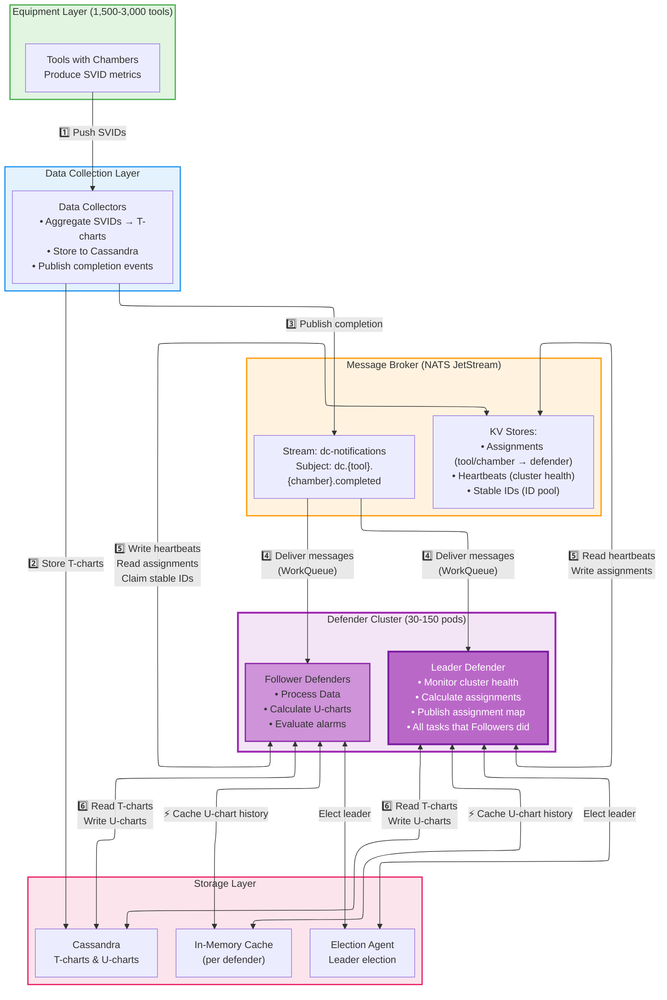
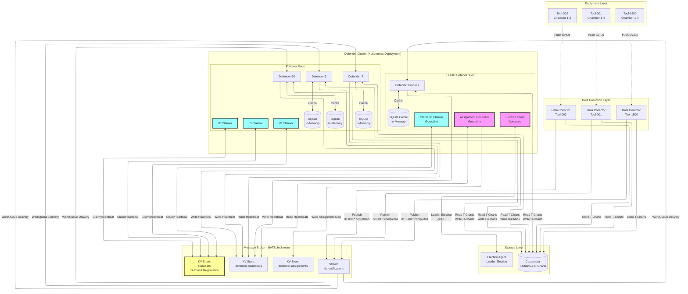

# High-Level System Architecture

## Overview

This document presents the high-level architecture of a **scalable, distributed, and stateless tFDC System** designed for collecting and fault detection with high-freqency and massive data volume.

### Design Focus

This architecture addresses the core challenges of building a dynamically scalable defender cluster that supports modern deployment practices:

1. **Scale Elastically** (30-150 defenders)
   - Scale up/down based on workload without rebalancing overhead
   - Add/remove defenders with minimal disruption (< 10 seconds)
   - Maintain cache locality during scaling (80%+ chambers unchanged)

2. **Advanced Deployment Strategies** (Critical Requirement)
   - **Context**: Data collectors and defenders release new versions regularly (weekly/monthly)
   - **Must support**: Rolling updates, blue-green, canary, progressive rollout
   - **See**: [Deployment Strategy Requirements](../01-requirements/constraints.md#deployment-strategy-requirements)
   - Update defenders with **ZERO assignment changes** (same ID = same chambers)
   - Enable routine deployments without service disruption
   - Support GitOps tools (Argo Rollouts, Flagger...etc)

3. **Fast Cold Start** (0 → N defenders)
   - Single assignment event instead of N rebalancing rounds
   - Cluster operational in ~31 seconds (vs 5-10 minutes with Kafka)
   - No stop-the-world pauses during initialization

4. **Rapid Failure Recovery**
   - Detect defender crashes in 6 seconds (3 missed heartbeats)
   - Redistribute chambers to remaining defenders in 8-10 seconds
   - Isolated impact (only affected tools paused in a short pereiod, not entire cluster)

5. **Stateless Design with Stable Identity**
   - No persistent storage (PVC) required
   - Self-assigned stable IDs (defender-0, defender-1, etc.) via NATS KV pool
   - In-memory cache (~100 MB) rebuilt after restart
   - Enables fast pod rescheduling and Kubernetes-native operations

### Key Design: Subject-Based Assignment vs Consumer Group Rebalancing

Unlike Kafka's partition-based consumer groups (which require cluster-wide rebalancing on every topology change), this design uses:

- **NATS JetStream** with subject-based routing
- **Chamber-level subjects** (`dc.{tool_id}.{chamber_id}.completed` with context id info)
- **Leader-controlled assignment** with consistent hashing
- **Dynamic subscriptions** that defenders can change without coordination overhead

**Why This Matters for Regular Version Releases**:
- Traditional systems (Kafka): Rolling update triggers 2N rebalancing events (leave + join for each pod)
- This design: Rolling update triggers **ZERO rebalancing events** (stable ID = same assignments)
- **Result**: Version updates become routine operations instead of high-risk maintenance windows
- **Production Impact**: Deploy new versions daily/weekly without service degradation

## System Layers

### Layer 1: Equipment Layer
**Purpose**: Send time series data from equipment through EQP Hub.

**Components**:
- 1,500-3,000 EQP Hubs (EQP Hub maps to tool)
- 1-4 chambers per tool
- 1500~8000 total processing units (chambers)

**Output**: Raw metrics (SVIDs) collected at specified frequencies

### Layer 2: Data Collection Layer
**Purpose**: Collect SVID metrics from equipment and store as T-charts in Cassandra

**Components**:
- Data Collector instances (stateless, serve all EQP Hubs for data ingestion)
- Background offline Cassandra ingestion (raw data for offline analysis purpose)

**Responsibilities**:
1. Receive SVID values through gRPC from EQP Hubs.
2. Pack received values using Mebo (space-efficient compression, ~3-4 bytes per point)
3. Generate and store T-charts (Mebo blob) to Cassandra per batch
4. Publish completion notification to NATS JetStream when context finishes

- **Stream**: `dc-notifications` (completion messages)
- **Subject Pattern**: `dc.{tool_id}.{chamber_id}.completed`

### Layer 3: Message Broker Layer
**Purpose**: Routing and delivery of completion notifications

**Technology**: NATS JetStream

**Components**:
- **Stream**: `dc-notifications` (completion messages)
- **KV Store**: `defender-assignments` (tool+chamber → defender mapping)
- **KV Store**: `defender-heartbeats` (cluster health tracking)

**Delivery**: WorkQueue pattern (at-least-once delivery)

### Layer 4: Processing Layer (Defender Cluster)
**Purpose**: Calculate T-charts or U-charts and evaluate defense strategies

**Components**:
- 30-150 defender replicas (Kubernetes Deployment with self-assigned stable IDs)
- Leader defender with embedded assignment controller
- Follower defenders

**Responsibilities**:
1. Claim stable ID from NATS KV pool (defender-0, defender-1, etc.)
2. Subscribe to assigned subjects
3. Fetch T-charts data for whole context from Cassandra
4. Calculate T-charts to U-charts (the float64 calculation result for T-chart)
5. Store U-charts to Cassandra
6. Maintain local cache for performance
7. Evaluate defense strategy rules
8. Raise alarms if thresholds exceeded

### Layer 5: Storage Layer
**Purpose**: Persistent data storage

**Components**:
- **Cassandra**: T-charts and U-charts
- **Election Agent**: Leader election service
- **NATS KV Store**: Stable ID pool and registration (defender ID claiming)
- **SQLite (per defender)**: In-memory cache WITHOUT PVC backup

## Simplified System Architecture Diagram

This simplified view focuses on the high-level data flow between major components:



**Key Data Flow:**
1. **Equipment → Collectors**: Tools send SVID metrics via gRPC polling
2. **Collectors → Cassandra**: Store compressed T-charts (Mebo format)
3. **Collectors → NATS**: Publish completion notification per chamber
4. **NATS → Defenders**: WorkQueue delivers messages to assigned defenders
5. **Defenders ↔ NATS KV**: Cluster coordination (heartbeats, assignments, ID claiming)
6. **Defenders ↔ Cassandra**: Fetch T-charts, store U-charts, query history
7. **Leader Election**: One defender becomes leader to manage assignments

**Critical Path** (latency-sensitive):
```
Equipment → Collector → NATS → Defender → Cassandra (T-chart) →
Calculate U-chart → Cassandra (U-chart) → Evaluate → Alarm
Total: ~2-5 seconds per chamber
```

## Data Structures and Schemas

For detailed data structure schemas (Stable ID Pool, Assignment Map, NATS KV structures), see:
- **[NATS JetStream Setup](../04-components/message-broker/nats-jetstream-setup.md)** - KV store schemas, subject patterns, stream configuration

## Detailed System Architecture Diagram

This detailed view shows internal components and all interactions:



## Message and Data Flows

For detailed sequence diagrams and data flow patterns, see **[Data Flow](./data-flow.md)**, which covers:

1. **[SVID Collection and T-Chart Generation](./data-flow.md#flow-1-svid-collection-and-t-chart-generation)** - Equipment → Data Collector → Cassandra → NATS notification
2. **[Completion Notification](./data-flow.md#flow-2-completion-notification)** - Data Collector publishes to NATS, WorkQueue delivers to defenders
3. **[Stable ID Claiming](./data-flow.md#flow-3-stable-id-claiming-startup)** - Defender startup, sequential ID search, heartbeat maintenance
4. **[Assignment Map Updates](./data-flow.md#flow-4-assignment-map-updates)** - Leader monitors heartbeats, calculates assignments, defenders update subscriptions
5. **[Chamber Message Routing](./data-flow.md#flow-5-chamber-message-routing)** - Subject-based routing from NATS to assigned defenders
6. **[Defense Processing](./data-flow.md#defense-processing)** - End-to-end processing flow with cache, calculation, and alarm evaluation

**Quick Reference - Key Flows**:
- **Cold Start**: Pod → Claim ID → Elect Leader → Calculate Assignments → Subscribe (~31s total)
- **Message Processing**: NATS → Defender → Cache Check → Cassandra → Calculate → Store → Ack (~2-5s)
- **Scale Event**: New Defender → Heartbeat → Leader Detects → Recalculate → Publish Assignments (~10-30s window)
- **Crash Recovery**: Missed Heartbeats → Leader Detects (6s) → Immediate Recalculation → Redistribute (<1s)

## Chamber Assignment and Load Balancing

### Overview

The assignment system determines which defender processes which chamber's messages. This is a **critical component** because:
- Chambers have vastly different workloads (30,000 to 3,600,000 data points)
- Poor assignment leads to defender overload (some 3-5× busier than others)
- Good assignment ensures uniform load distribution and cache efficiency

### Assignment Granularity: Tool + Chamber ID

**Assignment Unit**: `tool_id:chamber_id` (each chamber is assigned independently)

**Correct Approach** (Current Design):
- Each `tool:chamber` pair is a unique assignment unit
- Defender-5 might get: tool001:chamber1, tool005:chamber3, tool012:chamber2, tool050:chamber4
- This allows fine-grained weight-based load balancing

**Subject Pattern**: `dc.{tool_id}.{chamber_id}.completed`
- Each chamber has a unique NATS subject
- Defenders subscribe to specific tool:chamber combinations they're assigned

### Two-Phase Assignment Algorithm

The leader's assignment controller uses a **two-phase approach** to balance both chamber count AND workload weight:

#### Phase 1: Consistent Hashing (Even Distribution by Count)

**Purpose**: Distribute chambers evenly across defenders, minimize movement during scaling

**Algorithm**:
1. Create hash ring with 150-200 virtual nodes per defender
2. Hash each chamber using xxHash 64-bit: `hash("tool001:chamber1")`
3. Find next defender clockwise on ring (binary search, O(log N))
4. Assign chamber to that defender

**Result**:
- Each defender gets ~80 chambers (5,000 chambers ÷ 30 defenders)
- 80%+ chambers stay with same defender during scale operations
- Fast calculation: ~6ms for 5,000 chambers

**Code Example**:
```go
// Phase 1: Initial assignment
ring := NewRing(defenderIDs, vnodeCount=200)
assignments := make(map[string]string)

for _, chamber := range chambers {
    chamberKey := fmt.Sprintf("%s:%s", chamber.ToolID, chamber.ChamberID)
    defenderID := ring.Lookup(chamberKey)
    assignments[chamberKey] = defenderID
}
```

**Limitation**: Doesn't consider chamber weights (might assign 80 heavy chambers to one defender, 80 light to another)

#### Phase 2: Weight-Aware Rebalancing (Balance Workload)

**Purpose**: Correct load imbalances by considering chamber weights

**Chamber Weight Formula**:
```
Weight = SVID_count × Collection_Freq × Context_Duration
```

**Examples**:
- Lightweight: 50 SVIDs × 1 Hz × 600s = **30,000 weight**
- Medium: 100 SVIDs × 1 Hz × 1,200s = **120,000 weight**
- Heavy: 200 SVIDs × 10 Hz × 1,800s = **3,600,000 weight**

**Algorithm**:
1. Calculate total weight per defender from Phase 1 assignments
2. Calculate average weight: `total_weight / defender_count`
3. Identify overloaded defenders (>120% of average) and underloaded defenders (<80% of average)
4. Move heaviest chambers from overloaded to underloaded defenders
5. Stop when all defenders within ±20% threshold

**Threshold**: 20% (configurable)
- Allows 8,000,000 - 12,000,000 range if average is 10,000,000
- Balances between load fairness and cache locality preservation

**Code Example**:
```go
// Phase 2: Weight-aware rebalancing
avgWeight := totalWeight / int64(len(defenders))
maxWeight := avgWeight * 1.2  // +20%
minWeight := avgWeight * 0.8  // -20%

for overloadedDefender := range overloadedDefenders {
    for underloadedDefender := range underloadedDefenders {
        // Move heaviest chamber that fits
        chamber := findHeaviestChamber(overloadedDefender)
        if underloadedDefender.weight + chamber.weight <= maxWeight {
            assignments[chamber.key] = underloadedDefender.id
            // Update weights
            overloadedDefender.weight -= chamber.weight
            underloadedDefender.weight += chamber.weight
        }
    }
}
```

### Assignment Results

**Before Weight Rebalancing**:
```
Defender-0: 80 chambers, weight = 15,000,000 (50% above average) ❌
Defender-5: 80 chambers, weight = 6,000,000 (40% below average) ❌
Defender-12: 80 chambers, weight = 11,000,000 (10% above average) ✓

Standard deviation: 3,500,000 (35% variance)
```

**After Weight Rebalancing**:
```
Defender-0: 72 chambers, weight = 11,500,000 (15% above average) ✓
Defender-5: 88 chambers, weight = 9,200,000 (8% below average) ✓
Defender-12: 80 chambers, weight = 10,500,000 (5% above average) ✓

Standard deviation: 1,800,000 (18% variance)
Movement: 8 chambers (0.3% of total)
```

**Trade-offs**:
- **Slightly more movement**: 5-10% additional chamber reassignment vs consistent hashing alone
- **Significantly better balance**: All defenders within ±20% of average load
- **Preserved cache**: 95%+ chambers unchanged (70-75% from consistent hashing + minimal weight adjustment)

### Performance Characteristics

**Assignment Calculation Time** (30 defenders, 5,000 chambers):
- Phase 1 (Consistent Hashing): ~6 ms
- Phase 2 (Weight Rebalancing): ~6-10 ms
- **Total: ~12-16 ms** (acceptable for real-time rebalancing)

**Memory Usage**:
- Hash ring: 6,000 virtual nodes × 12 bytes = 72 KB
- Assignment map: 5,000 entries × 50 bytes = 250 KB
- Chamber weights: 5,000 entries × 16 bytes = 80 KB
- **Total: ~400 KB** (negligible)

### Operational Benefits

1. **Uniform Load Distribution**
   - All defenders process similar workload (±20%)
   - Predictable CPU/memory usage per defender
   - No "unlucky" defenders with all heavy chambers

2. **Predictable Scaling**
   - Know exact capacity: `total_weight / avg_weight_per_defender`
   - Example: 300M total weight ÷ 10M per defender = 30 defenders needed
   - Add defenders when average weight exceeds threshold

3. **Cache Efficiency**
   - Minimal chamber movement preserves cache locality
   - Scale 30→45: Only 20-25% chambers move (vs 33% for random assignment)
   - Cache hit rate remains high (80%+) during scaling

4. **SLO Compliance**
   - Uniform processing times across all defenders
   - No hot spots (overloaded defenders causing delays)
   - Consistent p95/p99 latencies

### Weight Metadata Management

**Update Strategy**:
- **Initial**: Estimated from equipment configuration
- **Runtime**: Recalculated every 24 hours based on actual metrics
- **Assignment**: Leader reads cached weights before calculation

**Configuration**:
```yaml
assignment_controller:
  weight_rebalancing:
    enabled: true
    threshold: 0.20  # ±20% from average
    max_iterations: 5
    preserve_locality: true

  weight_metadata:
    cassandra_table: "chamber_metadata"
    cache_ttl: 3600  # 1 hour
    update_interval: 86400  # 24 hours
```

### Scaling Behavior with Weight-Aware Balancing

**Scale Up** (30 → 45 defenders):
1. New defenders claim IDs, start heartbeating
2. Leader detects 45 active defenders
3. Phase 1: Consistent hashing distributes chambers (~53 per defender)
4. Phase 2: Weight rebalancing adjusts for load fairness
5. Total movement: ~25-30% chambers (20% from hashing, 5-10% from weight adjustment)
6. Result: All 45 defenders within ±20% of average load

**Scale Down** (45 → 30 defenders):
1. Kubernetes sends SIGTERM to 15 defenders
2. Defenders gracefully drain and release IDs
3. Leader recalculates with 30 defenders
4. Phase 1+2: Redistribute ~1,875 chambers (from removed defenders)
5. Result: Remaining 30 defenders evenly loaded (~80 chambers, balanced by weight)

## Operational Scenarios

For detailed operational behaviors, see **[Chapter 5: Operational Scenarios](../05-operational-scenarios/)**:

| Scenario | Timeline | Key Phases | Document |
|----------|----------|------------|----------|
| **Cold Start** | ~45-60s | Pod creation → ID claiming → Leader election → Assignment calculation → Subscribe | [cold-start.md](../05-operational-scenarios/cold-start.md) |
| **Scale-Up** | ~30-40s | New pods → Claim IDs → Heartbeats → Recalculate → Update subscriptions | [scale-up.md](../05-operational-scenarios/scale-up.md) |
| **Scale-Down** | ~40-60s | SIGTERM → Drain messages → Release IDs → Heartbeat loss → Recalculate | [scale-down.md](../05-operational-scenarios/scale-down.md) |
| **Crash Recovery** | 6s detect + <1s redistribute | Heartbeat timeout → Emergency recalculation → Redistribute chambers | [crash-recovery.md](../05-operational-scenarios/crash-recovery.md) |
| **Rolling Update** | Per-pod: ~45s | Blue/Green, Canary, Progressive rollout strategies | [rolling-update.md](../05-operational-scenarios/rolling-update.md) |

**Key Operational Highlights**:
- **Zero-Reassignment Updates**: Stable IDs enable rolling updates without rebalancing (0 vs 2N events)
- **State-Aware Recovery**: Crash triggers immediate redistribution, scale operations use 10-30s batching
- **Consistent Hashing**: 80%+ chambers unchanged during scale operations (preserves cache locality)

## Performance Characteristics

For detailed performance metrics and SLIs/SLOs, see **[Chapter 7: Monitoring](../07-monitoring/)**.

**Quick Reference**:

| Metric | Value | Context |
|--------|-------|---------|
| **Throughput (per defender)** | 5-10 msg/s | Typical chamber processing rate |
| **Throughput (30 defenders)** | 150-300 msg/s | Small cluster |
| **Throughput (100 defenders)** | 500-1000 msg/s | Large cluster |
| **Message Delivery (NATS)** | <10ms (p95) | JetStream latency |
| **Process Time** | <5s (p95) | End-to-end (cache → calculate → store) |
| **Cache Hit Processing** | ~1.2s | With U-chart history cached |
| **Cache Miss Processing** | ~1.5s | Fetch history from Cassandra |
| **CPU (per defender)** | 8-16 vCores | 8000m-16000m request/limit |
| **Memory (per defender)** | 8-16 GB | Includes in-memory cache |
| **Cache Size (per defender)** | ~100 MB | SQLite in-memory (U-chart history) |

## Related Documents

## Key Architectural Decisions Summary

For detailed rationale, trade-offs, and implementation examples, see **[Design Decisions](./design-decisions.md)**.

| Decision | Choice | Key Benefit | Reference |
|----------|--------|-------------|-----------|
| **Message Broker** | NATS JetStream | 10-20× faster operations, no rebalancing | [Why NATS](./design-decisions.md#message-broker) |
| **Assignment Strategy** | Leader-controlled | Simple (~200 lines), automatic failover | [Assignment Strategy](./design-decisions.md#assignment-strategy-leader-controlled-vs-distributed-consensus) |
| **Assignment Granularity** | Chamber-level | Fine-grained load balancing (2,400 units) | [Granularity](./design-decisions.md#assignment-granularity-tool-level-vs-chamber-level) |
| **Consistent Hashing** | 150-200 vnodes + xxHash 64-bit | Zero collisions, 80%+ chambers unchanged on scale | [Consistent Hashing](./design-decisions.md#consistent-hashing-virtual-nodes-and-hash-function) |
| **Weight-Aware Balancing** | Two-phase weighted consistent hashing | Balances workload (±20%), not just chamber count | [Weight Balancing](./design-decisions.md#weight-aware-load-balancing) |
| **Kubernetes Workload** | Deployment + stable IDs | Blue-green/canary support, zero reassignment | [Workload Type](./design-decisions.md#kubernetes-workload-deployment-vs-statefulset) |
| **Cache Storage** | In-memory only (no PVC) | Truly stateless, fast rescheduling | [Cache Storage](./design-decisions.md#cache-storage-pvc-vs-in-memory-only) |
| **ID Pool Size** | 200 IDs (configurable) | Handles 2× peak + rolling update overhead | [Pool Size](./design-decisions.md#stable-id-pool-size) |
| **Heartbeat Interval** | 2 seconds | 6s crash detection, moderate network overhead | [Heartbeat](./design-decisions.md#heartbeat-interval) |
| **Assignment Trigger** | State-aware (0s/10s/30s) | Crash=immediate, scale=fast, cold-start=batched | [Trigger Logic](./design-decisions.md#assignment-calculation-trigger-critical-part) |
| **Leader Election TTL** | 10 seconds (5s renewal) | 5-10s failover, balanced overhead | [Election TTL](./design-decisions.md#leader-election-ttl) |

**Critical Design Highlights**:

1. **Zero-Reassignment Rolling Updates**:
   - Traditional systems (Kafka): 2N rebalancing events per rolling update
   - This design: **0 rebalancing events** (stable ID = same chambers)
   - Result: Deploy new versions daily/weekly without service disruption

2. **State-Aware Crash Recovery**:
   - Cold start: 30s window (batch 30 defenders → 1 calculation)
   - Planned scale: 10s window (responsive but efficient)
   - Crash: **Immediate (<1s)** redistribution (no batching for emergencies)

3. **Hybrid Deployment Approach**:
   - Standard Kubernetes Deployment (flexible, GitOps-friendly)
   - Self-assigned stable IDs from NATS KV pool (consistent hashing benefits)
   - Best of both worlds: Simplicity + zero-downtime deployments

## Component Interactions

### Defender → NATS JetStream
- **Subscribe**: `dc.{tool_id}.{chamber_id}.completed` (dynamic)
- **Publish**: Heartbeat to `defender-heartbeats` KV
- **Watch**: `defender-assignments` KV for assignment changes

### Defender → NATS KV (Stable ID Pool)
- **Claim ID**: Atomic create on `stable-ids.defender-{N}` (sequential search until available)
- **Heartbeat**: Update `last_heartbeat` timestamp every 2 seconds
- **Release**: Delete key on graceful shutdown (SIGTERM)
- **Takeover**: Update stale claims (no heartbeat for 30s) using Compare-And-Swap

### Defender → Cassandra
- **Read**: T-charts
- **Read**: U-chart history
- **Write**: U-charts

### Defender → Election Agent
- **gRPC Call**: `Campaign`
- **gRPC Call**: `ExtendElectedTerm`
- **gRPC Call**: `Resign`
- **gRPC Call**: `GetLeader`
- **Behavior**: Only one defender becomes leader

### Assignment Controller → NATS KV
- **Write**: Assignment map to `defender-assignments`
- **Read**: Heartbeats from `defender-heartbeats`

### Data Collector → NATS JetStream
- **Publish**: Completion notification to `dc.{tool_id}.{chamber_id}.completed`
- **No Subscription**: One-way communication

## Scaling Behavior

### Horizontal Scaling
**Trigger**: HPA based on CPU/memory or custom metrics

**Scale Up** (30 → 45 defenders):
1. Kubernetes creates 15 new pods (random names)
2. New pods claim stable IDs from pool (defender-30 to defender-44)
3. New defenders publish heartbeats with stable IDs
4. Leader detects new defenders (batched in 30s window)
5. Leader calculates minimal chamber movements (~500 chambers, 20%)
6. Leader publishes new assignment map
7. All defenders update subscriptions (< 5 seconds)

**Scale Down** (45 → 30 defenders):
1. Kubernetes sends SIGTERM to 15 defenders
2. Defenders gracefully shutdown (unsubscribe, finish processing, release stable IDs)
3. Stable IDs (defender-30 to defender-44) become available in pool
4. Leader detects missing heartbeats
5. Leader redistributes chambers from removed defenders
6. Remaining defenders pick up chambers

### Blue-Green Deployment
**Deploy New Version Alongside Current**:

1. **Blue (current)**: 30 defenders with IDs defender-0 to defender-29
2. **Deploy Green**: 30 new defenders claim IDs defender-30 to defender-59
3. **Both running**: 60 defenders total, each processing ~40-50 chambers
4. **Validate Green**: Monitor metrics, logs, error rates
5. **Cutover**: Scale blue to 0 (releases defender-0 to 29)
6. **Green rebalance**: Optionally scale green to 30 and reclaim defender-0 to 29

**Benefits**: Full traffic split, easy rollback, zero downtime

### Canary Deployment
**Deploy Small Percentage of New Version**:

1. **Stable**: 27 defenders with IDs defender-0 to defender-26 (90%)
2. **Canary**: 3 defenders claim IDs defender-27 to defender-29 (10%)
3. **Monitor**: Compare canary metrics vs stable
4. **Promote**: Gradually roll out to all 30 defenders
5. **Rollback**: Delete canary pods if issues detected

**Benefits**: Low-risk validation, gradual rollout, quick rollback

### Vertical Scaling
**Not Recommended**: Use horizontal scaling instead

**Reason**: Leader election and assignment logic assumes homogeneous defenders

## Fault Tolerance

### Single Defender Crash
- **Detection**: 6 seconds (3 missed heartbeats)
- **Impact**: ~80 chambers redistributed to 29 remaining defenders
- **Recovery**: 8-10 seconds total
- **Message Handling**: NATS redelivers unacked messages

### Leader Crash
- **Detection**: 5-10 seconds (Election Agent timeout)
- **Impact**: Assignment controller paused during re-election
- **Recovery**: New leader starts assignment controller automatically
- **Defenders**: Continue processing (no interruption)

### NATS Node Failure
- **Impact**: None (NATS cluster with 3+ nodes)
- **Failover**: Automatic (< 5 seconds)

### Cassandra Node Failure
- **Impact**: None (replication factor = 3)
- **Failover**: Transparent (driver reconnects)

## Performance Characteristics

### Throughput
- **Per Defender**: 5-10 messages/second
- **Cluster** (30 defenders): 150-300 msg/s
- **Cluster** (100 defenders): 500-1000 msg/s

### Latency
- **Message Delivery** (NATS): < 10 ms (p95)
- **Process Time**: < 5 seconds (p95)
- **Cache Hit**: 1.2 seconds typical
- **Cache Miss**: 1.5 seconds typical

### Resource Usage
- **CPU** (per defender): 8-16 vCores (8000m-16000m)
- **Memory** (per defender): 8-16 GB
- **Storage** (cache per defender): ~100 MB (in-memory SQLite, U-chart history only)

## Related Documents

- [Design Decisions](./design-decisions.md) - Rationale for key architectural choices
- [Data Flow](./data-flow.md) - Detailed message and data flows
- [State Machine](./state-machine.md) - Cluster state machine details
- [Component Details](../04-components/) - Deep dive into each component
