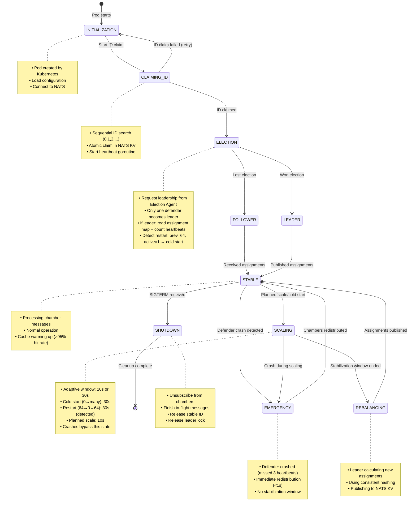
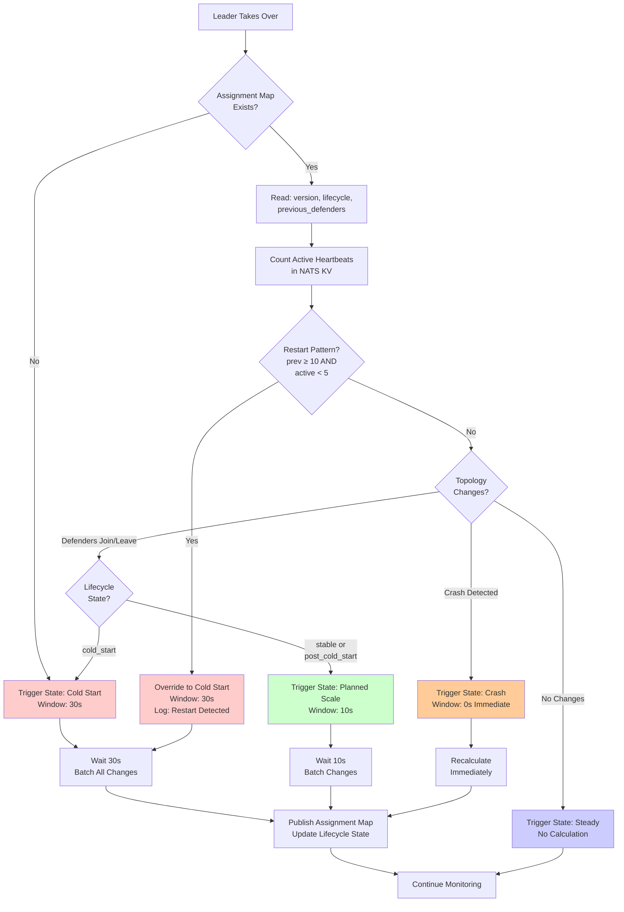

# Cluster State Machine

## Overview

This document describes the 8-state state machine that governs the defender cluster's operational lifecycle, including transitions between states, triggers, and actions.

## State Diagram



## Adaptive Triggering Strategy

The state machine uses **state-aware adaptive triggering** to optimize assignment recalculation based on the operational context:

### Trigger States

| State | Detection Criteria | Window | Next State | Rationale |
|-------|-------------------|--------|------------|-----------|
| **Cold Start** | 0 → 10+ defenders in <60s | 30 seconds | SCALING → REBALANCING | Batch all initial joins to prevent thrashing |
| **Restart** | prev=N (≥10), active<5, many joins | 30 seconds | SCALING → REBALANCING | Maintenance restart: treat as cold start |
| **Planned Scale** | Gradual joins/leaves, stable cluster | 10 seconds | SCALING → REBALANCING | Fast response, batch small bursts |
| **Crash** | Defender misses 3 heartbeats | Immediate (0s) | EMERGENCY → STABLE | Orphaned chambers need immediate reassignment |
| **Steady State** | No topology changes | No calculation | STABLE | Save CPU resources |

### Cluster Lifecycle Tracking

To distinguish between cold start and planned scale operations, the leader tracks cluster lifecycle state in the **assignment map metadata**. This is critical for:
1. **Determining correct window duration** (30s vs 10s)
2. **Leadership transfer** - new leader inherits cluster state
3. **Restart detection** - distinguish planned maintenance restart from normal operation

**Lifecycle States**:
- `cold_start`: Initial deployment (version 0 or no prior assignment) OR cluster restart detected
- `post_cold_start`: First successful assignment after cold start
- `stable`: Normal operation (version ≥ 2, cluster has been initialized)

**Restart Detection**:
The leader detects cluster restart by comparing:
- **Previous defender count** (from assignment map): e.g., 64 defenders
- **Current active heartbeats**: e.g., 1-2 defenders (just started)
- If `previous >= 10 AND current < 5`: This is a restart, use cold start mode (30s window)

**Why this matters**:
```
Scenario: Planned Maintenance
1. 64 defenders running, version=50, lifecycle=stable
2. kubectl scale --replicas=0 (shutdown all)
3. Assignment map persists: version=50, lifecycle=stable, 64 defenders
4. kubectl scale --replicas=64 (restart)
5. New leader reads: version=50, lifecycle=stable (would use 10s window - WRONG!)
6. Leader counts heartbeats: only 1 active
7. Leader detects: 64→1 = restart, override to cold_start mode (30s window - CORRECT!)
```

**Assignment Map Extended Schema**:
```json
{
  "version": 1,
  "timestamp": "2025-10-24T10:30:00Z",
  "state": "stable",
  "lifecycleState": "post_cold_start",  // NEW: Track cluster lifecycle
  "firstAssignmentAt": "2025-10-24T10:00:00Z",  // NEW: When cluster initialized
  "assignments": { ... },
  "defenderInfo": { ... }
}
```

### State Detection Logic

```go
type TriggerState int

const (
    StateColdStart    TriggerState = iota  // Initial deployment
    StatePlannedScale                      // Controlled scaling
    StateCrash                             // Emergency failure
    StateSteady                            // No changes
)

type ClusterLifecycle string

const (
    LifecycleColdStart     ClusterLifecycle = "cold_start"      // Version 0, no assignment yet
    LifecyclePostColdStart ClusterLifecycle = "post_cold_start" // Just completed first assignment
    LifecycleStable        ClusterLifecycle = "stable"          // Normal operation (version ≥ 2)
)

func detectTriggerState(changes []TopologyChange, currentDefenderCount int, previousDefenderCount int, firstChangeTime time.Time, lifecycle ClusterLifecycle) TriggerState {
    if len(changes) == 0 {
        return StateSteady
    }

    // Check for crashes (highest priority)
    for _, change := range changes {
        if change.Type == DefenderCrashed {
            return StateCrash
        }
    }

    // Cold start detection with restart protection:
    // Case 1: No prior assignment (version=0)
    // Case 2: Cluster restart - many defenders joining from 0 or very low count
    //         (e.g., maintenance: 64→0→64, previousDefenderCount from assignment map may be 64,
    //          but current active count before these changes was 0 or very low)
    timeSinceChange := time.Since(firstChangeTime)

    // If lifecycle says "cold_start" OR we detect restart pattern (0 → many defenders rapidly)
    if (lifecycle == LifecycleColdStart) ||
       (previousDefenderCount >= 10 && currentDefenderCount < 5 && len(changes) > 10 && timeSinceChange < 60*time.Second) {
        return StateColdStart
    }

    // Post-cold start or stable: cluster already initialized, use 10s window
    if lifecycle == LifecyclePostColdStart || lifecycle == LifecycleStable {
        return StatePlannedScale
    }

    // Planned scale: gradual changes
    return StatePlannedScale
}
```

### Leadership Transfer Handling

When a new leader takes over (due to previous leader crash or election), it must determine the cluster's lifecycle state:

```go
func (d *Defender) becomeLeader(ctx context.Context) error {
    log.Info("Became leader, initializing assignment controller")

    // 1. Read current assignment map from NATS KV
    assignmentKV := d.nats.KeyValue("defender-assignments")
    entry, err := assignmentKV.Get("current")

    var lifecycle ClusterLifecycle
    var currentVersion int
    var previousDefenderCount int

    if err == nats.ErrKeyNotFound {
        // No prior assignment exists - this is cold start
        lifecycle = LifecycleColdStart
        currentVersion = 0
        previousDefenderCount = 0
        log.Info("No prior assignment found, entering cold start mode")
    } else {
        // Parse existing assignment map
        var assignmentMap AssignmentMap
        json.Unmarshal(entry.Value(), &assignmentMap)

        lifecycle = ClusterLifecycle(assignmentMap.LifecycleState)
        currentVersion = assignmentMap.Version
        previousDefenderCount = len(assignmentMap.DefenderInfo)

        log.Info("Found existing assignment",
            "version", currentVersion,
            "lifecycle", lifecycle,
            "previous_defenders", previousDefenderCount)

        // CRITICAL: Check for cluster restart scenario
        // If assignment map says 64 defenders, but we only see 1-2 active heartbeats,
        // this is a restart (maintenance: 64→0→64)
        currentActiveDefenders := d.countActiveHeartbeats()

        if previousDefenderCount >= 10 && currentActiveDefenders < 5 {
            log.Warn("Detected cluster restart scenario",
                "previous_defenders", previousDefenderCount,
                "current_active", currentActiveDefenders,
                "forcing_cold_start_mode", true)

            // Override lifecycle to cold_start mode for this restart
            // This will use 30s window to batch all rejoining defenders
            lifecycle = LifecycleColdStart
        }
    }

    // 2. Start assignment controller with inherited state
    d.assignmentController = NewAssignmentController(
        d.nats,
        lifecycle,
        currentVersion,
        previousDefenderCount,
    )

    go d.runAssignmentController(ctx, lifecycle)
    return nil
}

// Helper: Count active defenders from heartbeat KV
func (d *Defender) countActiveHeartbeats() int {
    heartbeatKV := d.nats.KeyValue("defender-heartbeats")

    // List all keys in heartbeat bucket
    keys, err := heartbeatKV.Keys()
    if err != nil {
        return 0
    }

    now := time.Now()
    activeCount := 0

    for _, key := range keys {
        entry, err := heartbeatKV.Get(key)
        if err != nil {
            continue
        }

        var heartbeat HeartbeatData
        json.Unmarshal(entry.Value(), &heartbeat)

        // Consider active if heartbeat timestamp is within 10 seconds
        if now.Sub(heartbeat.Timestamp) < 10*time.Second {
            activeCount++
        }
    }

    return activeCount
}
```

### Lifecycle State Transitions

```go
func (ac *AssignmentController) publishAssignment(assignments map[string]string) error {
    // Determine next lifecycle state
    nextLifecycle := ac.determineNextLifecycle()

    assignmentMap := AssignmentMap{
        Version:          ac.currentVersion + 1,
        Timestamp:        time.Now(),
        State:            "stable",
        LifecycleState:   nextLifecycle,
        FirstAssignmentAt: ac.firstAssignmentTime,
        Assignments:      assignments,
        DefenderInfo:     ac.calculateDefenderStats(assignments),
    }

    // Publish to NATS KV
    data, _ := json.Marshal(assignmentMap)
    ac.assignmentKV.Put("current", data)

    ac.currentVersion++
    ac.currentLifecycle = nextLifecycle

    return nil
}

func (ac *AssignmentController) determineNextLifecycle() ClusterLifecycle {
    switch ac.currentLifecycle {
    case LifecycleColdStart:
        // First assignment after cold start
        return LifecyclePostColdStart
    case LifecyclePostColdStart:
        // Second assignment, now stable
        return LifecycleStable
    case LifecycleStable:
        // Stay stable
        return LifecycleStable
    default:
        return LifecycleStable
    }
}
```

### Example Scenarios

**Scenario 1: Cold Start (30s window)**
```
T+0s:   Deployment created, defender-0 joins
        Assignment map: version=0, lifecycle=cold_start (doesn't exist yet)
T+2s:   defender-1 joins
T+4s:   defender-2 joins
...
T+28s:  defender-29 joins
T+30s:  State=COLD_START → Calculate once for all 30 defenders
        Assignment map published: version=1, lifecycle=post_cold_start
        Result: 1 calculation instead of 30 (30× efficiency gain)
```

**Scenario 2: Planned Scale-Up (10s window)**
```
T+0s:   30 defenders stable
        Assignment map: version=5, lifecycle=stable
T+100s: defender-30 joins → pending
        Leader reads lifecycle=stable → uses 10s window
T+105s: defender-31 joins → pending
T+110s: State=PLANNED_SCALE → Calculate for 32 defenders
        Assignment map published: version=6, lifecycle=stable (unchanged)
        Result: Fast 10s response, batched 2 joins
```

**Scenario 3: Crash (immediate)**
```
T+0s:   30 defenders stable
T+100s: defender-15 misses heartbeat #1
T+102s: defender-15 misses heartbeat #2
T+104s: defender-15 misses heartbeat #3
T+104s: State=CRASH → Calculate immediately (29 defenders)
        Result: <1s redistribution, no waiting
```

**Scenario 4: Crash During Scaling Window**
```
T+0s:   30 defenders stable
T+100s: defender-30 joins → SCALING state (10s window)
T+105s: defender-31 joins → accumulate
T+107s: defender-15 CRASHES → abort SCALING, enter EMERGENCY
T+107s: Immediate recalculation (30 defenders: 29 old + 1 new)
        Result: Emergency takes priority over planned scale
```

**Scenario 5: Leadership Transfer After Cold Start**
```
T+0s:   Cold start complete
        Assignment map: version=1, lifecycle=post_cold_start
T+100s: defender-0 (leader) CRASHES
T+106s: defender-1 elected as new leader
T+106s: New leader reads assignment map: version=1, lifecycle=post_cold_start
        New leader: "Cluster already initialized, use 10s window for future scales"
T+200s: defender-30 joins → PLANNED_SCALE (10s window, not 30s)
        Assignment map published: version=2, lifecycle=stable
```

**Scenario 6: Leadership Transfer During Cold Start**
```
T+0s:   defender-0 becomes leader, detects cold start
T+5s:   10 defenders joined, waiting for 30s stabilization window
T+15s:  defender-0 (leader) CRASHES (before completing first assignment)
T+21s:  defender-1 elected as new leader
T+21s:  New leader reads assignment map: Key not found → lifecycle=cold_start
        New leader: "No prior assignment, this is cold start, use 30s window"
T+21s:  New leader detects 10 defenders, starts 30s window
T+51s:  30s window expires, first assignment published
        Assignment map: version=1, lifecycle=post_cold_start
```

**Scenario 7: Planned Maintenance Restart (CRITICAL)**

This scenario demonstrates the restart detection mechanism that prevents incorrect window selection after maintenance.

```
Initial State:
        64 defenders running, version=50, lifecycle=stable

Maintenance Shutdown:
T+0s:   kubectl scale deployment defender --replicas=0
T+5s:   All 64 defenders gracefully shutdown (clean SIGTERM)
        ⚠️  Assignment map PERSISTS: version=50, lifecycle=stable, 64 defenders
        ⚠️  Heartbeat KV entries expire (TTL=30s)

Maintenance Restart:
T+100s: kubectl scale deployment defender --replicas=64
T+100s: defender-0 starts, becomes leader

T+100s: Leader initialization - Restart Detection Phase:
        ┌─────────────────────────────────────────────────────────┐
        │ 1. Read assignment map from NATS KV                     │
        │    → version=50, lifecycle=stable, defenders=64         │
        │                                                         │
        │ 2. Count active heartbeats in NATS KV                  │
        │    → active_count=1 (only defender-0 itself)           │
        │                                                         │
        │ 3. Compare: previous=64, active=1                      │
        │    → Ratio: 64:1 = RESTART DETECTED!                   │
        │                                                         │
        │ 4. Override lifecycle: stable → cold_start             │
        │    → Use 30s window (not 10s)                          │
        └─────────────────────────────────────────────────────────┘

        Log: "Detected cluster restart: 64→1, forcing cold start mode"

T+101-130s: 64 defenders start and join rapidly
            • Each publishes heartbeat immediately
            • Leader accumulates all joins (no recalculation yet)
            • 30s stabilization window active

T+130s: 30s window expires → Single assignment calculation
        • All 64 defenders included in one calculation
        • Assignment map: version=51, lifecycle=post_cold_start

        ✅ Result: 1 calculation instead of 64 (30s window worked correctly!)
        ✅ Prevented: 64 individual 10s windows = 640+ seconds of thrashing
```

**Detection Logic Summary**:
| Check | Value | Decision |
|-------|-------|----------|
| Assignment map exists? | Yes (version=50) | Read previous state |
| Previous defender count | 64 | From assignment map |
| Current active heartbeats | 1 | Count from heartbeat KV |
| Comparison | 64 ≥ 10 AND 1 < 5 | **RESTART DETECTED** |
| Action | Override lifecycle | stable → cold_start |
| Window used | 30 seconds | Batch all 64 joins |

### Scenario Comparison Matrix

This table summarizes all triggering scenarios and how the system responds:

| Scenario | Assignment Map | Active Defenders | Prev Count | Detected State | Window | Rationale |
|----------|---------------|------------------|------------|----------------|--------|-----------|
| **Cold Start** | Not found | 0→30 (rapid) | 0 | Cold Start | 30s | Initial deployment, batch all joins |
| **Planned Scale** | version=5, stable | 30→32 (gradual) | 30 | Planned Scale | 10s | Small change, fast response |
| **Crash** | version=5, stable | 30→29 (missing HB) | 30 | Crash | 0s | Emergency, immediate action |
| **Maintenance Restart** | version=50, stable | 64→1→64 (rapid) | 64 | Cold Start* | 30s | Restart detected, batch rejoin |
| **Rolling Update** | version=10, stable | 30→25→30 (gradual) | 30 | Planned Scale | 10s | Gradual pod replacement |
| **Partial Failure** | version=20, stable | 64→50 (crashes) | 64 | Planned Scale | 10s | Not restart (50>5 threshold) |
| **Leadership Transfer (stable)** | version=30, stable | 45 (unchanged) | 45 | Planned Scale | 10s | Inherit stable state |
| **Leadership Transfer (cold start)** | Not found | 10 (growing) | 0 | Cold Start | 30s | Continue cold start |

*Restart detection overrides lifecycle state based on defender count ratio

**Key Detection Rules**:
1. **No assignment map** → Cold Start (30s)
2. **Lifecycle = stable + previous≥10 + active<5** → Restart Override → Cold Start (30s)
3. **Lifecycle = stable + normal active count** → Planned Scale (10s)
4. **Any crash detected** → Emergency (0s)

### Trigger Detection Flow

This flowchart shows how the leader determines which window to use:



## State Definitions

### 1. INITIALIZATION
**Duration**: 1-3 seconds

**Description**: Defender pod starts and initializes core components.

**Entry Conditions**:
- Kubernetes creates pod
- Container starts

**Activities**:
```go
func (d *Defender) Initialize(ctx context.Context) error {
    // 1. Load configuration from env vars
    d.config = loadConfig()

    // 2. Connect to NATS JetStream
    nc, js := connectNATS(d.config.NATSServers)
    d.nats = js

    // 3. Initialize KV stores
    d.heartbeatKV = js.KeyValue("defender-heartbeats")
    d.assignmentKV = js.KeyValue("defender-assignments")
    d.stableIDKV = js.KeyValue("stable-ids")

    // 4. Initialize Cassandra client
    d.cassandra = connectCassandra(d.config.CassandraHosts)

    // 5. Initialize in-memory cache
    d.cache = initializeSQLiteCache()

    // Transition to CLAIMING_ID
    return nil
}
```

**Exit Conditions**:
- All connections established → CLAIMING_ID
- Connection failure → INITIALIZATION (retry)

**Metrics**:
- `defender_initialization_duration_seconds`
- `defender_initialization_failures_total`

---

### 2. CLAIMING_ID
**Duration**: 100-500 milliseconds (typical)

**Description**: Defender claims stable ID from NATS KV pool.

**Entry Conditions**:
- INITIALIZATION complete

**Activities**:
```go
func (d *Defender) ClaimStableID(ctx context.Context) (string, error) {
    podUID := os.Getenv("POD_UID")

    // Sequential search for available ID
    for id := 0; id < d.config.MaxDefenders; id++ {
        defenderID := fmt.Sprintf("defender-%d", id)
        key := fmt.Sprintf("stable-ids.%s", defenderID)

        // Try atomic claim
        registration := IDRegistration{
            DefenderID:    defenderID,
            PodUID:        podUID,
            ClaimedAt:     time.Now(),
            LastHeartbeat: time.Now(),
            TTL:           10 * time.Second,
        }

        data, _ := json.Marshal(registration)
        _, err := d.stableIDKV.Create(key, data)

        if err == nil {
            // Successfully claimed!
            d.stableID = defenderID
            go d.maintainIDClaim(ctx, key)
            return defenderID, nil
        }

        // Check if stale (can takeover)
        if d.canTakeoverStaleID(key) {
            if d.takeoverID(key, registration) {
                d.stableID = defenderID
                go d.maintainIDClaim(ctx, key)
                return defenderID, nil
            }
        }
    }

    return "", ErrPoolExhausted
}
```

**Exit Conditions**:
- ID claimed successfully → ELECTION
- Pool exhausted → INITIALIZATION (retry after delay)

**Metrics**:
- `defender_id_claim_attempts_total`
- `defender_id_claim_duration_seconds`
- `defender_stable_id_claimed{id="defender-5"}`

---

### 3. ELECTION
**Duration**: 100-500 milliseconds

**Description**: Defender participates in leader election.

**Entry Conditions**:
- Stable ID claimed

**Activities**:
```go
func (d *Defender) ParticipateInElection(ctx context.Context) (bool, error) {
    // Request leadership from Election Agent
    resp, err := d.electionClient.AcquireLeadership(ctx, &election.LeadershipRequest{
        CandidateID: d.stableID,
        TTL:         10, // seconds
    })

    if err != nil {
        return false, err
    }

    if resp.IsLeader {
        d.isLeader = true
        d.leadershipToken = resp.Token

        // Start leadership renewal goroutine
        go d.renewLeadership(ctx)

        // Start assignment controller
        go d.runAssignmentController(ctx)

        return true, nil
    }

    d.isLeader = false
    return false, nil
}
```

**Exit Conditions**:
- Won election → LEADER
- Lost election → FOLLOWER

**Metrics**:
- `defender_election_participated_total`
- `defender_is_leader{defender="defender-5"}` (gauge)

---

### 4A. LEADER
**Duration**: Variable (until assignments ready)

**Description**: Defender becomes cluster leader, starts assignment controller.

**Entry Conditions**:
- Won election

**Activities**:
```go
func (d *Defender) runAssignmentController(ctx context.Context) {
    log.Info("Starting assignment controller", "defender", d.stableID)

    // 1. Read current assignment map to determine lifecycle state
    assignmentKV := d.nats.KeyValue("defender-assignments")
    entry, err := assignmentKV.Get("current")

    var lifecycle ClusterLifecycle
    if err == nats.ErrKeyNotFound {
        lifecycle = LifecycleColdStart
        log.Info("No prior assignment, starting in cold start mode")
    } else {
        var assignmentMap AssignmentMap
        json.Unmarshal(entry.Value(), &assignmentMap)
        lifecycle = ClusterLifecycle(assignmentMap.LifecycleState)
        log.Info("Inherited lifecycle state", "lifecycle", lifecycle, "version", assignmentMap.Version)
    }

    ticker := time.NewTicker(2 * time.Second)
    defer ticker.Stop()

    trigger := NewAssignmentTrigger(lifecycle)

    for {
        select {
        case <-ctx.Done():
            return
        case <-ticker.C:
            // Read all heartbeats
            heartbeats := d.readAllHeartbeats()

            // Detect topology changes
            changes := d.detectTopologyChanges(heartbeats)

            if len(changes) > 0 {
                // Detect state and determine trigger strategy
                state := trigger.DetectState(changes)

                switch state {
                case StateCrash:
                    // Emergency: immediate recalculation
                    d.handleEmergency(changes)
                case StateColdStart:
                    // Cold start: enter SCALING state (30s window)
                    d.handleScalingEvent(changes, 30*time.Second)
                case StatePlannedScale:
                    // Planned scale: enter SCALING state (10s window)
                    d.handleScalingEvent(changes, 10*time.Second)
                }
            }
        }
    }
}
```

**Exit Conditions**:
- Assignments published → STABLE
- Lost leadership → FOLLOWER

**Metrics**:
- `defender_assignment_controller_started_total`
- `defender_leadership_duration_seconds`

---

### 4B. FOLLOWER
**Duration**: Variable (until assignments received)

**Description**: Defender operates as follower, waits for leader's assignments.

**Entry Conditions**:
- Lost election

**Activities**:
```go
func (d *Defender) waitForAssignments(ctx context.Context) error {
    // Watch assignment KV for changes
    watcher, err := d.assignmentKV.Watch(ctx, "current")
    if err != nil {
        return err
    }

    for update := range watcher.Updates() {
        if update == nil {
            continue
        }

        var assignmentMap AssignmentMap
        json.Unmarshal(update.Value(), &assignmentMap)

        // Extract my assignments
        myChambers := d.extractMyAssignments(assignmentMap, d.stableID)

        // Transition to STABLE
        d.applyChamberAssignments(myChambers)
        return nil
    }

    return ErrWatchFailed
}
```

**Exit Conditions**:
- Assignments received → STABLE
- Leadership acquired → LEADER

**Metrics**:
- `defender_follower_wait_duration_seconds`

---

### 5. STABLE
**Duration**: Variable (normal operation)

**Description**: Defender processes chamber messages in steady state.

**Entry Conditions**:
- LEADER: Assignments published
- FOLLOWER: Assignments received

**Activities**:
```go
func (d *Defender) processMessages(ctx context.Context) {
    // Subscribe to assigned chambers
    for _, chamber := range d.chambers {
        subject := fmt.Sprintf("dc.%s.%s.completed", chamber.ToolID, chamber.ChamberID)
        d.nats.Subscribe(subject, d.handleMessage)
    }

    // Publish heartbeat every 2 seconds
    go d.publishHeartbeat(ctx)

    // Process messages continuously
    for {
        select {
        case <-ctx.Done():
            return
        case msg := <-d.messageQueue:
            d.processMessage(msg)
        }
    }
}

func (d *Defender) handleMessage(msg *nats.Msg) {
    // 1. Check cache for U-chart history
    history := d.cache.GetUChartHistory(msg.ToolID, msg.ChamberID)

    // 2. Fetch T-chart from Cassandra
    tchart := d.cassandra.FetchTChart(msg.CycleID)

    // 3. Calculate U-chart
    uchart := d.calculateUChart(tchart, history)

    // 4. Evaluate defense strategy
    alarm := d.evaluateStrategy(uchart)
    if alarm != nil {
        d.raiseAlarm(alarm)
    }

    // 5. Store U-chart
    d.cassandra.StoreUChart(uchart)
    d.cache.UpdateHistory(uchart)

    // 6. Ack message
    msg.Ack()
}
```

**Exit Conditions**:
- Topology change detected → SCALING (leader only)
- Crash detected → EMERGENCY (leader only)
- SIGTERM received → SHUTDOWN

**Metrics**:
- `defender_messages_processed_total`
- `defender_process_time_seconds` (histogram)
- `defender_cache_hit_rate` (gauge)
- `defender_assigned_chambers` (gauge)

---

### 6. SCALING
**Duration**: 10-30 seconds (adaptive stabilization window)

**Description**: Leader detects topology changes and waits for stabilization before recalculation.

**Entry Conditions**:
- **Cold Start**: 0 → many defenders in <60s (30s window)
- **Planned Scale**: Gradual defender joins/leaves (10s window)
- Note: Crashes skip this state and go directly to EMERGENCY

**Activities**:
```go
func (d *Defender) handleScalingEvent(changes []TopologyChange, windowDuration time.Duration) {
    log.Info("Scaling event detected",
        "changes", len(changes),
        "window", windowDuration)

    // Enter stabilization window
    d.state = SCALING
    d.scalingStartTime = time.Now()

    // Collect changes for adaptive window (10s or 30s)
    timer := time.NewTimer(windowDuration)
    defer timer.Stop()

    pendingChanges := changes

    for {
        select {
        case <-timer.C:
            // Stabilization window ended
            d.state = REBALANCING
            d.rebalance(pendingChanges)
            return

        case newChange := <-d.topologyChangeChan:
            // Check if new change is a crash
            if newChange.Type == DefenderCrashed {
                // Crash detected during scaling window
                // Abort current window and handle emergency
                d.state = EMERGENCY
                d.handleEmergency([]TopologyChange{newChange})
                return
            }

            // Accumulate additional non-crash changes
            pendingChanges = append(pendingChanges, newChange)

            // Reset timer (extend window)
            if !timer.Stop() {
                <-timer.C
            }
            timer.Reset(windowDuration)
        }
    }
}
```

**Exit Conditions**:
- Stabilization window ended → REBALANCING

**Metrics**:
- `defender_scaling_events_total`
- `defender_scaling_duration_seconds`
- `defender_pending_topology_changes` (gauge)

---

### 7. REBALANCING
**Duration**: 1-5 seconds (assignment calculation)

**Description**: Leader calculates new chamber assignments using consistent hashing.

**Entry Conditions**:
- SCALING stabilization window ended

**Activities**:
```go
func (d *Defender) rebalance(changes []TopologyChange) {
    log.Info("Calculating new assignments", "changes", len(changes))

    // 1. Get current defender list
    defenders := d.getActiveDefenders()

    // 2. Build consistent hash ring
    hashRing := d.buildHashRing(defenders)

    // 3. Assign chambers to defenders
    assignments := make(map[string]string) // chamber -> defender
    for _, chamber := range d.chambers {
        defender := hashRing.Get(chamber.Key())
        assignments[chamber.Key()] = defender
    }

    // 4. Calculate statistics
    defenderInfo := d.calculateDefenderStats(assignments)

    // 5. Publish assignment map
    assignmentMap := AssignmentMap{
        Version:      d.assignmentVersion + 1,
        Timestamp:    time.Now(),
        State:        "stable",
        Assignments:  assignments,
        DefenderInfo: defenderInfo,
    }

    data, _ := json.Marshal(assignmentMap)
    d.assignmentKV.Put("current", data)

    d.assignmentVersion++
    d.state = STABLE

    log.Info("Assignments published",
        "version", assignmentMap.Version,
        "defenders", len(defenders),
        "chambers", len(assignments))
}
```

**Exit Conditions**:
- Assignments published → STABLE

**Metrics**:
- `defender_rebalance_duration_seconds`
- `defender_assignment_version` (gauge)
- `defender_chamber_movements_total`

---

### 8. EMERGENCY
**Duration**: <1 second (immediate recalculation)

**Description**: Leader handles defender crash with immediate redistribution (no stabilization window).

**Entry Conditions**:
- Defender missed 3 consecutive heartbeats (6 seconds)
- Detected as crash event (not graceful shutdown)
- **Bypasses SCALING state** for immediate response

**Activities**:
```go
func (d *Defender) handleEmergency(changes []TopologyChange) {
    crashedDefenders := []string{}
    for _, change := range changes {
        if change.Type == DefenderCrashed {
            crashedDefenders = append(crashedDefenders, change.DefenderID)
        }
    }

    log.Warn("Emergency: defender(s) crashed",
        "defenders", crashedDefenders,
        "count", len(crashedDefenders))

    d.state = EMERGENCY

    // Get crashed defenders' chambers
    currentAssignments := d.getCurrentAssignments()
    crashedChambers := []string{}
    for chamber, defender := range currentAssignments {
        for _, crashed := range crashedDefenders {
            if defender == crashed {
                crashedChambers = append(crashedChambers, chamber)
                break
            }
        }
    }

    log.Info("Redistributing chambers", "count", len(crashedChambers))

    // Redistribute immediately (NO stabilization window)
    activeDefenders := d.getActiveDefenders()
    hashRing := d.buildHashRing(activeDefenders)

    // Update assignments
    for _, chamber := range crashedChambers {
        newDefender := hashRing.Get(chamber)
        currentAssignments[chamber] = newDefender
    }

    // Publish updated assignment map
    assignmentMap := AssignmentMap{
        Version:     d.assignmentVersion + 1,
        Timestamp:   time.Now(),
        State:       "stable",
        Assignments: currentAssignments,
    }

    data, _ := json.Marshal(assignmentMap)
    d.assignmentKV.Put("current", data)

    d.assignmentVersion++
    d.state = STABLE
}
```

**Exit Conditions**:
- Chambers redistributed → STABLE

**Metrics**:
- `defender_emergency_events_total`
- `defender_emergency_duration_seconds`
- `defender_crashed_chambers_redistributed`

---

### 9. SHUTDOWN
**Duration**: 5-30 seconds

**Description**: Defender gracefully shuts down.

**Entry Conditions**:
- SIGTERM received from Kubernetes

**Activities**:
```go
func (d *Defender) Shutdown(ctx context.Context) error {
    log.Info("Graceful shutdown initiated", "defender", d.stableID)

    d.state = SHUTDOWN

    // 1. Stop accepting new messages
    d.stopMessageProcessing()

    // 2. Finish in-flight messages (timeout: 25s)
    d.waitForInFlightMessages(25 * time.Second)

    // 3. Unsubscribe from all chambers
    for _, sub := range d.subscriptions {
        sub.Unsubscribe()
    }

    // 4. Release stable ID claim
    key := fmt.Sprintf("stable-ids.%s", d.stableID)
    d.stableIDKV.Delete(key)

    // 5. Release leadership (if leader)
    if d.isLeader {
        d.electionClient.ReleaseLeadership(ctx, d.leadershipToken)
    }

    // 6. Close connections
    d.nats.Close()
    d.cassandra.Close()
    d.cache.Close()

    log.Info("Shutdown complete", "defender", d.stableID)
    return nil
}
```

**Exit Conditions**:
- Cleanup complete → [*] (process exits)

**Metrics**:
- `defender_shutdowns_total`
- `defender_shutdown_duration_seconds`
- `defender_inflight_messages_at_shutdown`

## State Transition Matrix

| From State | To State | Trigger | Duration |
|-----------|----------|---------|----------|
| [*] | INITIALIZATION | Pod starts | 1-3s |
| INITIALIZATION | CLAIMING_ID | Connections ready | - |
| CLAIMING_ID | ELECTION | ID claimed | 0.1-0.5s |
| ELECTION | LEADER | Won election + restart check | 0.1-0.5s |
| ELECTION | FOLLOWER | Lost election | 0.1-0.5s |
| LEADER | STABLE | Assignments published | 1-2s |
| FOLLOWER | STABLE | Assignments received | 1-2s |
| STABLE | SCALING | Planned scale/cold start/restart | - |
| STABLE | EMERGENCY | Crash detected | - |
| STABLE | SHUTDOWN | SIGTERM | - |
| SCALING | REBALANCING | Window ended (10s/30s) | 10-30s (adaptive) |
| SCALING | EMERGENCY | Crash during scaling | - |
| REBALANCING | STABLE | Assignments published | 1-5s |
| EMERGENCY | STABLE | Redistribution done | <1s |
| SHUTDOWN | [*] | Cleanup complete | 5-30s |

**Notes**:
- **ELECTION → LEADER**: New leader reads assignment map and counts active heartbeats to detect restart scenario
- **STABLE → SCALING**: Trigger can be cold start (30s), restart (30s, detected), or planned scale (10s)
- **SCALING duration**: Adaptive based on detected state (30s for cold start/restart, 10s for planned scale)

## Metrics Summary

| Metric | Type | Description |
|--------|------|-------------|
| `defender_state` | Gauge | Current state (0-9) |
| `defender_state_transitions_total` | Counter | Total transitions by state |
| `defender_state_duration_seconds` | Histogram | Time spent in each state |
| `defender_is_leader` | Gauge | 1 if leader, 0 otherwise |
| `defender_assigned_chambers` | Gauge | Number of chambers assigned |
| `defender_messages_processed_total` | Counter | Total messages processed |
| `defender_cache_hit_rate` | Gauge | Cache hit percentage |
| `defender_trigger_state{state="cold_start\|planned_scale\|crash"}` | Counter | Count of each trigger type |
| `defender_restart_detected_total` | Counter | Times cluster restart was detected |
| `defender_stabilization_window_seconds{type="cold_start\|planned_scale"}` | Histogram | Window duration used |
| `defender_active_heartbeat_count` | Gauge | Active defenders (from heartbeat KV) |
| `defender_assignment_map_version` | Gauge | Current assignment map version |

## Related Documents

- [High-Level Design](./high-level-design.md) - System architecture
- [Design Decisions](./design-decisions.md) - Why these states
- [Data Flow](./data-flow.md) - Message flows
- [Cold Start Scenario](../05-operational-scenarios/cold-start.md) - State transitions during startup
