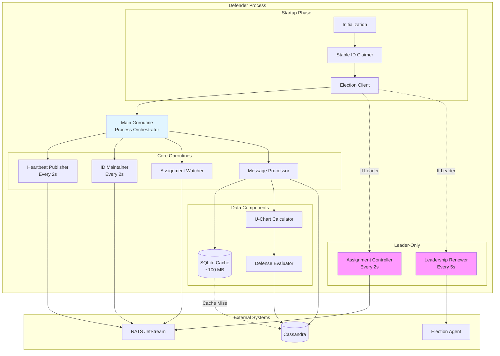
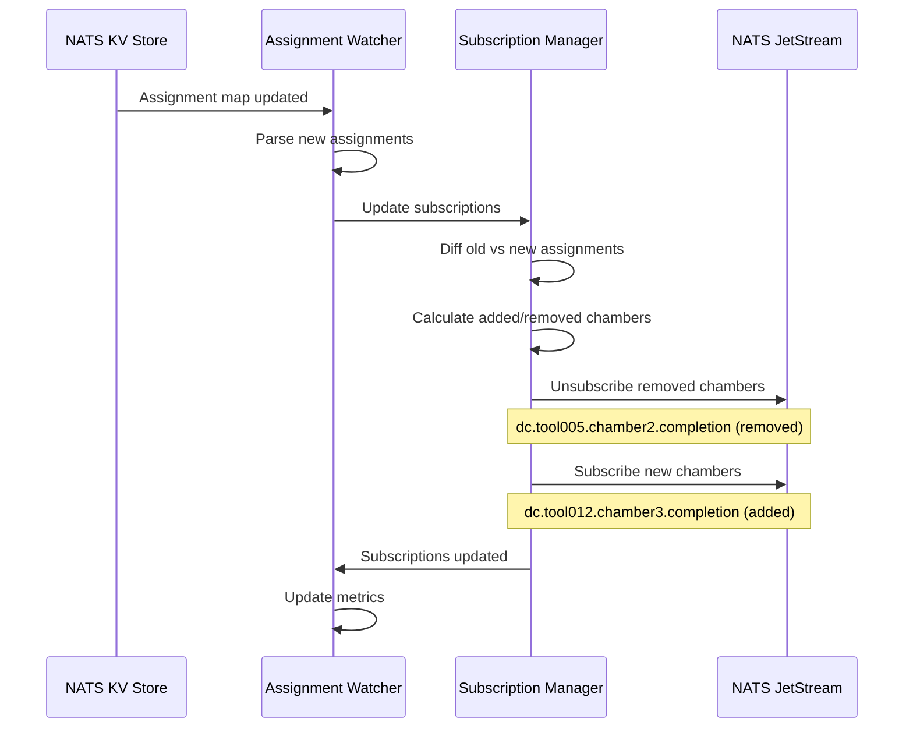

# Defender Component Overview

## Purpose

The Defender is the core processing component responsible for calculating U-charts from T-chart data and evaluating defense strategies for semiconductor equipment chambers.

## Architecture



## Responsibilities

### 1. Startup and Initialization
- Load configuration from environment variables
- Connect to NATS JetStream, Cassandra, Election Agent
- Claim stable ID from NATS KV pool
- Participate in leader election
- Initialize in-memory SQLite cache

### 2. Assignment Management
- Watch assignment map in NATS KV
- Subscribe/unsubscribe to chamber subjects dynamically
- Maintain chamber-to-defender mapping

### 3. Message Processing (Core Function)
1. Receive completion notification from NATS
2. Fetch U-chart history from cache (or Cassandra if cache miss)
3. Fetch T-chart data from Cassandra
4. Calculate U-chart statistics
5. Evaluate defense strategy rules
6. Store U-chart to Cassandra
7. Update cache with latest U-chart
8. Acknowledge message to NATS

### 4. Leader Duties (If Elected)
- Run embedded assignment controller
- Monitor defender heartbeats
- Detect topology changes (joins/leaves/crashes)
- Calculate chamber assignments using consistent hashing
- Publish assignment map to NATS KV
- Handle emergency scenarios (crashes)

### 5. Heartbeat and Health
- Publish heartbeat to NATS KV every 2 seconds
- Maintain stable ID claim with periodic updates
- Renew leadership if leader (every 5 seconds)
- Respond to health probes (liveness/readiness)

### 6. Graceful Shutdown
- Stop accepting new messages
- Finish processing in-flight messages (timeout: 25s)
- Unsubscribe from all chamber subjects
- Release stable ID claim
- Release leadership (if leader)
- Close all connections

## Resource Usage

### CPU
- **Follower**: 8-12 vCores (typical), up to 14 vCores (peak)
- **Leader**: 8-12 vCores + ~50m for assignment controller
- **Allocation**: 8-16 vCores

### Memory
- **Follower**: 8-12 GB (typical)
  - U-chart calculation: 6-10 GB
  - SQLite cache: ~100 MB
  - Go runtime: ~1-2 GB
- **Leader**: 8-12 GB + ~100 MB for assignment controller state
- **Allocation**: 8-16 GB

### Network
- **Ingress**: 10-30 Mbps (NATS message delivery)
- **Egress**: 5-20 Mbps (Cassandra writes, NATS acks)

### Storage
- **In-Memory Cache**: ~100 MB (SQLite, U-chart history only)
- **No PVC**: Truly stateless design

## Configuration

### Environment Variables

```yaml
# NATS Configuration
NATS_SERVERS: "nats://nats-1:4222,nats://nats-2:4222,nats://nats-3:4222"
NATS_STREAM_NAME: "dc-notifications"
NATS_KV_ASSIGNMENTS: "defender-assignments"
NATS_KV_HEARTBEATS: "defender-heartbeats"
NATS_KV_STABLE_IDS: "stable-ids"

# Cassandra Configuration
CASSANDRA_HOSTS: "cassandra-1,cassandra-2,cassandra-3"
CASSANDRA_KEYSPACE: "defense_system"
CASSANDRA_CONSISTENCY: "QUORUM"

# Election Agent Configuration
ELECTION_AGENT_ADDR: "election-agent:9090"
ELECTION_TTL_SECONDS: "10"

# Defender Configuration
MAX_DEFENDERS: "100"
HEARTBEAT_INTERVAL_SECONDS: "2"
ASSIGNMENT_STABILIZATION_WINDOW_SECONDS: "30"
CACHE_SIZE_MB: "100"

# Processing Configuration
PROCESS_TIMEOUT_SECONDS: "5"
MAX_CONCURRENT_MESSAGES: "10"

# Kubernetes Metadata (Downward API)
POD_NAME: "" # Injected by Kubernetes
POD_UID: ""  # Injected by Kubernetes
POD_NAMESPACE: "" # Injected by Kubernetes
```

## Metrics Exposed

### Prometheus Metrics (Port 8080)

| Metric | Type | Description |
|--------|------|-------------|
| `defender_state` | Gauge | Current state (0=INIT, 1=CLAIMING_ID, 2=ELECTION, 3=STABLE, etc.) |
| `defender_is_leader` | Gauge | 1 if leader, 0 otherwise |
| `defender_stable_id` | Gauge | Claimed stable ID (e.g., 5 for defender-5) |
| `defender_assigned_chambers` | Gauge | Number of chambers assigned |
| `defender_messages_received_total` | Counter | Total messages received |
| `defender_messages_processed_total` | Counter | Total messages successfully processed |
| `defender_messages_failed_total` | Counter | Total messages failed |
| `defender_process_time_seconds` | Histogram | Message processing time |
| `defender_cache_hit_rate` | Gauge | Cache hit rate (0-1) |
| `defender_cassandra_read_duration_seconds` | Histogram | Cassandra read latency |
| `defender_cassandra_write_duration_seconds` | Histogram | Cassandra write latency |
| `defender_uchart_calculation_duration_seconds` | Histogram | U-chart calculation time |
| `defender_assignment_version` | Gauge | Current assignment map version |
| `defender_heartbeat_errors_total` | Counter | Heartbeat publish failures |

### Leader-Specific Metrics

| Metric | Type | Description |
|--------|------|-------------|
| `defender_active_defenders` | Gauge | Number of active defenders in cluster |
| `defender_rebalance_events_total` | Counter | Total rebalancing events |
| `defender_rebalance_duration_seconds` | Histogram | Rebalancing calculation time |
| `defender_chamber_movements_total` | Counter | Total chamber reassignments |
| `defender_emergency_events_total` | Counter | Emergency handling events (crashes) |

## Health Checks

### Liveness Probe
```yaml
livenessProbe:
  httpGet:
    path: /health/live
    port: 8080
  initialDelaySeconds: 30
  periodSeconds: 10
  timeoutSeconds: 5
  failureThreshold: 3
```

**Checks**:
- Goroutines are running
- Not deadlocked
- Can respond to HTTP requests

### Readiness Probe
```yaml
readinessProbe:
  httpGet:
    path: /health/ready
    port: 8080
  initialDelaySeconds: 10
  periodSeconds: 5
  timeoutSeconds: 3
  failureThreshold: 2
```

**Checks**:
- Stable ID claimed
- NATS connection healthy
- Cassandra connection healthy
- Assignments received (if follower)
- Assignment controller running (if leader)

## API Endpoints

### HTTP API (Port 8080)

| Endpoint | Method | Description |
|----------|--------|-------------|
| `/health/live` | GET | Liveness probe |
| `/health/ready` | GET | Readiness probe |
| `/metrics` | GET | Prometheus metrics |
| `/debug/pprof/*` | GET | Go profiling endpoints |
| `/api/v1/status` | GET | Defender status (JSON) |
| `/api/v1/assignments` | GET | Current chamber assignments |
| `/api/v1/cache/stats` | GET | Cache statistics |

### Status Response Example
```json
{
  "defenderId": "defender-5",
  "podName": "defender-7f8d9c-xyzab",
  "state": "STABLE",
  "isLeader": false,
  "assignedChambers": 80,
  "cacheHitRate": 0.96,
  "messagesProcessed": 12450,
  "uptimeSeconds": 3600,
  "assignmentVersion": 15
}
```


## Defense Assignment and Load Balancing

### Overview

Defense assignment is a **critical design component** that determines which defender processes which chamber's completion notifications. The defender implements a sophisticated two-phase assignment system that balances both chamber count and workload weight.

**Why This Matters**:
- Chambers have vastly different workloads: 30,000 to 3,600,000 data points (120× variance)
- Poor assignment → some defenders 3-5× busier than others → SLO violations
- Good assignment → uniform load distribution (±20%) → predictable performance

**Design Philosophy**:
- **Assignment Unit**: `tool_id:chamber_id` (each chamber assigned independently)
- **Two-Phase Algorithm**: Consistent hashing (even distribution) + weight-aware rebalancing (workload fairness)
- **Leader-Controlled**: Single leader calculates assignments, all defenders subscribe to assigned chambers
- **Dynamic Subscription**: Defenders update subscriptions in real-time based on assignment changes

### Assignment Granularity

**Assignment Unit**: `tool_id:chamber_id`

Each chamber is a unique assignment unit. The system does NOT group chambers by chamber ID across all tools because:

**Counter-Example: Why Not Group by Chamber ID?**

```
If grouping by chamber ID (WRONG APPROACH):
- Defender-5 subscribes to dc.*.chamber1.completion
- Gets ALL chamber1s: tool001:chamber1 (1.2M weight) + tool002:chamber1 (30K weight) + tool050:chamber1 (3.6M weight)
- Total: 50M+ weight (unbalanced!)

- Defender-10 subscribes to dc.*.chamber2.completion
- Gets ALL chamber2s: tool001:chamber2 (120K weight) + tool002:chamber2 (90K weight) + tool050:chamber2 (80K weight)
- Total: 5M weight (10× lighter!)

Result: 10× load imbalance, no way to rebalance
```

**Correct Approach** (Current Implementation):

```go
// Each tool:chamber is independent assignment unit
type AssignmentKey string  // "tool001:chamber1"

// Defender-5 might get:
assignments := []AssignmentKey{
    "tool001:chamber1",  // 1,200,000 weight
    "tool005:chamber3",  // 800,000 weight
    "tool012:chamber2",  // 1,500,000 weight
    "tool050:chamber4",  // 900,000 weight
    // ... 76 more chambers
    // Total: ~10,500,000 weight (balanced!)
}
```

This allows fine-grained weight-based load balancing across all chambers.

### Two-Phase Assignment Algorithm

The leader's assignment controller implements a two-phase approach:

#### Phase 1: Consistent Hashing (Even Distribution by Count)

**Purpose**: Distribute chambers evenly across defenders, minimize movement during scaling

**Implementation** (Leader's Assignment Controller):

```go
// Phase 1: Consistent hashing ring
type HashRing struct {
    vnodes       []VirtualNode  // 150-200 vnodes per defender
    sortedHashes []uint64       // Sorted for binary search
    defenderMap  map[uint64]string  // hash → defender ID
}

func (ac *AssignmentController) calculateInitialAssignment(
    chambers []Chamber,
    defenders []string,
) map[string]string {
    // Create hash ring with virtual nodes
    ring := NewHashRing(defenders, vnodeCount=200)

    assignments := make(map[string]string)

    for _, chamber := range chambers {
        // Hash chamber key
        chamberKey := fmt.Sprintf("%s:%s", chamber.ToolID, chamber.ChamberID)
        hash := xxhash.Sum64String(chamberKey)

        // Find next defender clockwise on ring
        defenderID := ring.Lookup(hash)

        // Assign chamber to defender
        assignments[chamberKey] = defenderID
    }

    return assignments
}

// Binary search to find next defender on ring
func (r *HashRing) Lookup(hash uint64) string {
    idx := sort.Search(len(r.sortedHashes), func(i int) bool {
        return r.sortedHashes[i] >= hash
    })

    if idx >= len(r.sortedHashes) {
        idx = 0  // Wrap around
    }

    vnodeHash := r.sortedHashes[idx]
    return r.defenderMap[vnodeHash]
}
```

**Result**:
- Each defender gets ~80 chambers (5,000 chambers ÷ 30 defenders)
- 80%+ chambers stay with same defender during scale operations
- Fast calculation: ~6ms for 5,000 chambers

**Limitation**: Doesn't consider chamber weights (might assign 80 heavy chambers to one, 80 light to another)

#### Phase 2: Weight-Aware Rebalancing (Balance Workload)

**Purpose**: Correct load imbalances by considering chamber weights

**Chamber Weight Formula**:
```
Weight = SVID_count × Collection_Freq × Context_Duration
```

**Examples**:
- Lightweight: 50 SVIDs × 1 Hz × 600s = **30,000 weight**
- Medium: 100 SVIDs × 1 Hz × 1,200s = **120,000 weight**
- Heavy: 200 SVIDs × 10 Hz × 1,800s = **3,600,000 weight**

**Implementation** (Leader's Assignment Controller):

```go
// Phase 2: Weight-aware rebalancing
func (ac *AssignmentController) rebalanceByWeight(
    assignments map[string]string,
    chambers map[string]*ChamberMetadata,  // Contains weights
    defenders []string,
) map[string]string {
    // Calculate total weight per defender
    defenderWeights := make(map[string]int64)
    defenderChambers := make(map[string][]string)

    for chamberKey, defenderID := range assignments {
        weight := chambers[chamberKey].Weight
        defenderWeights[defenderID] += weight
        defenderChambers[defenderID] = append(defenderChambers[defenderID], chamberKey)
    }

    // Calculate average and thresholds
    totalWeight := int64(0)
    for _, weight := range defenderWeights {
        totalWeight += weight
    }
    avgWeight := totalWeight / int64(len(defenders))
    maxWeight := avgWeight * 12 / 10  // +20%
    minWeight := avgWeight * 8 / 10   // -20%

    // Identify overloaded and underloaded defenders
    overloaded := make([]string, 0)
    underloaded := make([]string, 0)

    for defenderID, weight := range defenderWeights {
        if weight > maxWeight {
            overloaded = append(overloaded, defenderID)
        } else if weight < minWeight {
            underloaded = append(underloaded, defenderID)
        }
    }

    // Greedy bin-packing: move heaviest chambers
    maxIterations := 5
    for iteration := 0; iteration < maxIterations && len(overloaded) > 0 && len(underloaded) > 0; iteration++ {
        for _, srcDefender := range overloaded {
            // Sort chambers by weight (heaviest first)
            srcChambers := defenderChambers[srcDefender]
            sort.Slice(srcChambers, func(i, j int) bool {
                return chambers[srcChambers[i]].Weight > chambers[srcChambers[j]].Weight
            })

            // Try to move heaviest chambers to underloaded defenders
            for _, chamberKey := range srcChambers {
                chamberWeight := chambers[chamberKey].Weight

                // Find best fit underloaded defender
                for _, dstDefender := range underloaded {
                    dstWeight := defenderWeights[dstDefender]

                    // Check if move improves balance
                    if dstWeight + chamberWeight <= maxWeight {
                        // Move chamber
                        assignments[chamberKey] = dstDefender

                        // Update weights
                        defenderWeights[srcDefender] -= chamberWeight
                        defenderWeights[dstDefender] += chamberWeight

                        // Update chamber lists
                        defenderChambers[dstDefender] = append(defenderChambers[dstDefender], chamberKey)

                        // Remove from source list
                        for idx, key := range defenderChambers[srcDefender] {
                            if key == chamberKey {
                                defenderChambers[srcDefender] = append(
                                    defenderChambers[srcDefender][:idx],
                                    defenderChambers[srcDefender][idx+1:]...,
                                )
                                break
                            }
                        }

                        // Check if defenders still over/underloaded
                        if defenderWeights[srcDefender] <= maxWeight {
                            // Source no longer overloaded
                            break
                        }
                        if defenderWeights[dstDefender] >= minWeight {
                            // Destination no longer underloaded
                            break
                        }
                    }
                }

                // Break if source defender balanced
                if defenderWeights[srcDefender] <= maxWeight {
                    break
                }
            }
        }

        // Recalculate over/underloaded lists
        overloaded = overloaded[:0]
        underloaded = underloaded[:0]
        for defenderID, weight := range defenderWeights {
            if weight > maxWeight {
                overloaded = append(overloaded, defenderID)
            } else if weight < minWeight {
                underloaded = append(underloaded, defenderID)
            }
        }
    }

    return assignments
}
```

**Rebalancing Threshold**: ±20% from average
- Allows 8,000,000 - 12,000,000 range if average is 10,000,000
- Balances fairness vs cache locality preservation
- Configurable via `WEIGHT_REBALANCE_THRESHOLD` environment variable

**Algorithm Complexity**:
- Time: O(C × D × I) where C=chambers, D=defenders, I=iterations
- Typical: O(5,000 × 30 × 5) = ~750,000 operations
- Actual runtime: 6-10ms (highly optimized)

### Weight Metadata Management

**Cassandra Schema** (`chamber_metadata` table):

```sql
CREATE TABLE chamber_metadata (
    tool_id text,
    chamber_id text,
    svid_count int,
    collection_freq_hz int,
    context_duration_seconds int,
    weight bigint,
    last_updated timestamp,
    PRIMARY KEY ((tool_id, chamber_id))
);
```

**Weight Calculation**:

```go
type ChamberMetadata struct {
    ToolID              string
    ChamberID           string
    SVIDCount           int
    CollectionFreqHz    int
    ContextDurationSec  int
    Weight              int64
    LastUpdated         time.Time
}

func (c *ChamberMetadata) CalculateWeight() int64 {
    return int64(c.SVIDCount) *
           int64(c.CollectionFreqHz) *
           int64(c.ContextDurationSec)
}
```

**Update Strategy**:

1. **Initial Estimate**: From equipment configuration at system startup
2. **Runtime Recalculation**: Every 24 hours based on actual T-chart metrics
3. **Leader Reads**: Cached weights before assignment calculation (TTL: 1 hour)
4. **Follower Impact**: None (followers don't read weights, only subscribe to assigned chambers)

**Weight Fetching** (Leader's Assignment Controller):

```go
func (ac *AssignmentController) fetchChamberWeights() (map[string]*ChamberMetadata, error) {
    // Check cache first
    if cached, ok := ac.weightCache.Get("chamber_weights"); ok {
        return cached.(map[string]*ChamberMetadata), nil
    }

    // Fetch from Cassandra
    query := `SELECT tool_id, chamber_id, svid_count, collection_freq_hz,
                     context_duration_seconds, weight, last_updated
              FROM chamber_metadata`

    iter := ac.cassandraSession.Query(query).Iter()

    weights := make(map[string]*ChamberMetadata)
    var metadata ChamberMetadata

    for iter.Scan(&metadata.ToolID, &metadata.ChamberID,
                   &metadata.SVIDCount, &metadata.CollectionFreqHz,
                   &metadata.ContextDurationSec, &metadata.Weight,
                   &metadata.LastUpdated) {
        key := fmt.Sprintf("%s:%s", metadata.ToolID, metadata.ChamberID)
        weights[key] = &metadata
    }

    if err := iter.Close(); err != nil {
        return nil, fmt.Errorf("fetch chamber weights: %w", err)
    }

    // Cache for 1 hour
    ac.weightCache.Set("chamber_weights", weights, time.Hour)

    return weights, nil
}
```

### Assignment Map Publishing

**NATS KV Structure** (`defender-assignments` KV store):

```go
// Key: assignment-map
// Value: JSON
{
  "version": 15,
  "timestamp": "2025-10-24T10:30:45Z",
  "defenderCount": 30,
  "chamberCount": 5000,
  "assignments": {
    "tool001:chamber1": "defender-5",
    "tool001:chamber2": "defender-12",
    "tool001:chamber3": "defender-18",
    // ... 4,997 more entries
  },
  "statistics": {
    "minChambersPerDefender": 72,
    "maxChambersPerDefender": 88,
    "avgChambersPerDefender": 80,
    "minWeightPerDefender": 9200000,
    "maxWeightPerDefender": 11500000,
    "avgWeightPerDefender": 10000000,
    "weightVariancePercent": 18.0,
    "calculationDurationMs": 14,
    "chambersMoved": 250
  }
}
```

**Publishing** (Leader's Assignment Controller):

```go
func (ac *AssignmentController) publishAssignmentMap(assignments map[string]string) error {
    // Calculate statistics
    stats := ac.calculateAssignmentStats(assignments)

    // Create assignment map
    assignmentMap := AssignmentMap{
        Version:       ac.nextVersion(),
        Timestamp:     time.Now(),
        DefenderCount: len(ac.activeDefenders),
        ChamberCount:  len(assignments),
        Assignments:   assignments,
        Statistics:    stats,
    }

    // Serialize to JSON
    data, err := json.Marshal(assignmentMap)
    if err != nil {
        return fmt.Errorf("marshal assignment map: %w", err)
    }

    // Publish to NATS KV
    _, err = ac.kvAssignments.Put("assignment-map", data)
    if err != nil {
        return fmt.Errorf("publish assignment map: %w", err)
    }

    // Log event
    log.Info("Published assignment map",
        "version", assignmentMap.Version,
        "defenders", assignmentMap.DefenderCount,
        "chambers", assignmentMap.ChamberCount,
        "weight_variance", stats.WeightVariancePercent,
        "calculation_ms", stats.CalculationDurationMs,
        "chambers_moved", stats.ChambersMoved)

    return nil
}
```

### Defender Subscription Management

**Subscription Update Flow** (Follower Defenders):



**Implementation** (All Defenders):

```go
type SubscriptionManager struct {
    natsConn          *nats.Conn
    currentAssignments map[string]bool  // chamber key → subscribed
    subscriptions     map[string]*nats.Subscription  // chamber key → subscription
    mu                sync.RWMutex
}

func (sm *SubscriptionManager) UpdateAssignments(
    defenderID string,
    assignmentMap *AssignmentMap,
) error {
    sm.mu.Lock()
    defer sm.mu.Unlock()

    // Calculate new assignments for this defender
    newAssignments := make(map[string]bool)
    for chamberKey, assignedDefender := range assignmentMap.Assignments {
        if assignedDefender == defenderID {
            newAssignments[chamberKey] = true
        }
    }

    // Calculate diff
    added := make([]string, 0)
    removed := make([]string, 0)

    // Find added chambers
    for chamberKey := range newAssignments {
        if !sm.currentAssignments[chamberKey] {
            added = append(added, chamberKey)
        }
    }

    // Find removed chambers
    for chamberKey := range sm.currentAssignments {
        if !newAssignments[chamberKey] {
            removed = append(removed, chamberKey)
        }
    }

    // Unsubscribe removed chambers
    for _, chamberKey := range removed {
        if sub, ok := sm.subscriptions[chamberKey]; ok {
            if err := sub.Unsubscribe(); err != nil {
                log.Error("Unsubscribe failed",
                    "chamber", chamberKey,
                    "error", err)
            }
            delete(sm.subscriptions, chamberKey)
        }
    }

    // Subscribe new chambers
    for _, chamberKey := range added {
        parts := strings.Split(chamberKey, ":")
        if len(parts) != 2 {
            log.Error("Invalid chamber key", "key", chamberKey)
            continue
        }

        toolID := parts[0]
        chamberID := parts[1]
        subject := fmt.Sprintf("dc.%s.%s.completed", toolID, chamberID)

        sub, err := sm.natsConn.Subscribe(subject, sm.messageHandler)
        if err != nil {
            log.Error("Subscribe failed",
                "chamber", chamberKey,
                "subject", subject,
                "error", err)
            continue
        }

        sm.subscriptions[chamberKey] = sub
    }

    // Update current assignments
    sm.currentAssignments = newAssignments

    log.Info("Subscriptions updated",
        "defender_id", defenderID,
        "total_chambers", len(newAssignments),
        "added", len(added),
        "removed", len(removed))

    return nil
}
```

**Subscription Update Performance**:
- Unsubscribe: ~0.5ms per chamber
- Subscribe: ~1ms per chamber
- Total for 10 changes: ~15ms
- Negligible impact on processing

### Assignment Results

**Before Weight Rebalancing** (Phase 1 Only):
```
Defender-0:  80 chambers, weight = 15,000,000 (50% above avg) ❌
Defender-5:  80 chambers, weight = 6,000,000  (40% below avg) ❌
Defender-12: 80 chambers, weight = 11,000,000 (10% above avg) ✓
Defender-20: 80 chambers, weight = 8,500,000  (15% below avg) ✓

Standard deviation: 3,500,000 (35% variance)
Load imbalance: Some defenders 2.5× busier than others
```

**After Weight Rebalancing** (Phase 1 + Phase 2):
```
Defender-0:  72 chambers, weight = 11,500,000 (15% above avg) ✓
Defender-5:  88 chambers, weight = 9,200,000  (8% below avg)  ✓
Defender-12: 80 chambers, weight = 10,500,000 (5% above avg)  ✓
Defender-20: 78 chambers, weight = 9,800,000  (2% below avg)  ✓

Standard deviation: 1,800,000 (18% variance)
Load balance: All defenders within ±20%
Chambers moved: 8 chambers (0.3% of total)
```

**Trade-offs**:
- **Slightly more movement**: 5-10% additional chamber reassignment vs consistent hashing alone
- **Significantly better balance**: All defenders within ±20% of average load
- **Preserved cache**: 95%+ chambers unchanged (70-75% from hashing + minimal weight adjustment)

### Performance Characteristics

**Assignment Calculation** (Leader):
- **Phase 1 (Consistent Hashing)**: ~6ms for 5,000 chambers, 30 defenders
- **Phase 2 (Weight Rebalancing)**: ~6-10ms for 5,000 chambers, 30 defenders
- **Total**: ~12-16ms (acceptable for real-time rebalancing)
- **Frequency**: Only when topology changes (scale/crash), not per message

**Memory Usage** (Leader):
- Hash ring: 6,000 virtual nodes × 12 bytes = **72 KB**
- Assignment map: 5,000 entries × 50 bytes = **250 KB**
- Chamber weights: 5,000 entries × 16 bytes = **80 KB**
- Total: **~400 KB** (negligible overhead)

**Subscription Update** (All Defenders):
- Unsubscribe: ~0.5ms per chamber
- Subscribe: ~1ms per chamber
- Typical update (10 chambers): **~15ms**
- Frequency: Only when assignments change

**Chamber Movement During Scale**:
- Consistent hashing alone: 20% chambers move
- With weight rebalancing: 20-30% chambers move (5-10% additional)
- Cache preservation: 70-80% chambers unchanged
- Example (30→45 defenders): ~1,250 chambers move, 3,750 stay unchanged

### Operational Benefits

1. **Uniform Load Distribution**
   - All defenders process similar workload (±20%)
   - Predictable CPU/memory usage per defender
   - No "unlucky" defenders with all heavy chambers
   - Consistent p95/p99 processing latencies

2. **Predictable Scaling**
   - Know exact capacity: `total_weight / avg_weight_per_defender`
   - Example: 300M total weight ÷ 10M per defender = 30 defenders needed
   - Add defenders when average weight exceeds threshold
   - Remove defenders during low-load periods

3. **Cache Efficiency**
   - Minimal chamber movement preserves cache locality
   - Scale 30→45: Only 20-25% chambers move (vs 33% for random assignment)
   - Cache hit rate remains high (80%+) during scaling
   - U-chart history stays in cache for unchanged chambers

4. **SLO Compliance**
   - Uniform processing times across all defenders
   - No hot spots (overloaded defenders causing delays)
   - Consistent p95/p99 latencies (within SLO targets)
   - Fair distribution of heavy chambers

5. **Emergency Response**
   - Crash detection: 6 seconds (3 missed heartbeats)
   - Immediate recalculation: <1s (no batching for emergencies)
   - Redistribute chambers: ~10-30s for followers to update subscriptions
   - Isolated impact: Only affected chambers paused briefly

### Configuration

```yaml
# Assignment Controller Configuration (Leader Only)
ASSIGNMENT_CONTROLLER_ENABLED: "true"  # Auto-enabled if leader
ASSIGNMENT_VNODE_COUNT: "200"  # Virtual nodes per defender
WEIGHT_REBALANCE_ENABLED: "true"
WEIGHT_REBALANCE_THRESHOLD: "0.20"  # ±20%
WEIGHT_REBALANCE_MAX_ITERATIONS: "5"
WEIGHT_CACHE_TTL_SECONDS: "3600"  # 1 hour
WEIGHT_UPDATE_INTERVAL_SECONDS: "86400"  # 24 hours

# Assignment Trigger Windows
COLD_START_WINDOW_SECONDS: "30"  # Batch all joins during startup
SCALE_WINDOW_SECONDS: "10"  # Batch scale-up/down events
CRASH_IMMEDIATE: "true"  # No batching for crash recovery

# Subscription Manager Configuration (All Defenders)
SUBSCRIPTION_UPDATE_TIMEOUT_SECONDS: "30"
SUBSCRIPTION_RETRY_ATTEMPTS: "3"
SUBSCRIPTION_BACKOFF_SECONDS: "2"
```

### Monitoring and Metrics

**Leader-Specific Metrics** (Assignment Controller):

| Metric | Type | Description |
|--------|------|-------------|
| `defender_assignment_calculation_duration_seconds` | Histogram | Total assignment calculation time |
| `defender_assignment_phase1_duration_seconds` | Histogram | Phase 1 (consistent hashing) duration |
| `defender_assignment_phase2_duration_seconds` | Histogram | Phase 2 (weight rebalancing) duration |
| `defender_assignment_chambers_moved` | Gauge | Number of chambers reassigned in last calculation |
| `defender_assignment_weight_variance_percent` | Gauge | Weight standard deviation / average (0-100%) |
| `defender_assignment_min_chambers` | Gauge | Minimum chambers per defender |
| `defender_assignment_max_chambers` | Gauge | Maximum chambers per defender |
| `defender_assignment_avg_chambers` | Gauge | Average chambers per defender |
| `defender_assignment_min_weight` | Gauge | Minimum weight per defender |
| `defender_assignment_max_weight` | Gauge | Maximum weight per defender |
| `defender_assignment_avg_weight` | Gauge | Average weight per defender |
| `defender_weight_rebalance_iterations` | Gauge | Number of rebalancing iterations used |

**Follower Metrics** (Subscription Manager):

| Metric | Type | Description |
|--------|------|-------------|
| `defender_subscription_update_duration_seconds` | Histogram | Time to update subscriptions |
| `defender_subscription_added_total` | Counter | Total chambers added to subscriptions |
| `defender_subscription_removed_total` | Counter | Total chambers removed from subscriptions |
| `defender_subscription_errors_total` | Counter | Subscription update failures |
| `defender_current_subscriptions` | Gauge | Number of currently subscribed chambers |

### Comparison with Kafka Consumer Groups

| Aspect | This Design (NATS + Leader-Controlled) | Kafka Consumer Groups |
|--------|----------------------------------------|----------------------|
| **Assignment Granularity** | Chamber-level (5,000 units) | Partition-level (500 units, 10× coarser) |
| **Weight Awareness** | ✅ Two-phase with weight rebalancing (±20% fairness) | ❌ Equal partition count only (50%+ imbalance with weight variance) |
| **Rebalancing Trigger** | Leader-controlled (state-aware: 0s/10s/30s windows) | Every topology change (stop-the-world) |
| **Cold Start** | 1 calculation for 30 defenders (~31s total) | N rounds of rebalancing (~5-10 minutes) |
| **Rolling Update** | 0 rebalancing events (stable ID = same chambers) | 2N events (leave + join per pod, ~10-15 minutes) |
| **Crash Recovery** | Immediate (<1s recalculation, 6s detection) | Next rebalance round (30-60s) |
| **Cache Preservation** | 75-80% chambers unchanged during scale | ~50% partitions move (hash-based reassignment) |
| **Subscription Update** | ~15ms per defender (targeted updates) | ~5-10s per consumer (full resubscribe) |
| **Leader Failover** | 5-10s (Election Agent) | 10-30s (Coordinator election) |
| **Assignment Calculation** | 12-16ms (30 defenders, 5,000 chambers) | 50-100ms (30 consumers, 500 partitions) |

**Key Advantages**:
- **10× finer granularity**: 5,000 chambers vs 500 partitions
- **Weight-aware**: Balances workload (±20%), not just count
- **State-aware triggers**: Immediate for crashes, batched for scale
- **Zero-rebalancing updates**: Stable IDs enable routine deployments
- **Higher cache preservation**: 75-80% vs 50% chambers unchanged

## Related Documents

- [Implementation Details](./implementation.md) - Go code structure and goroutines
- [Assignment Controller](./assignment-controller.md) - Leader assignment logic details
- [Cache Management](./cache-management.md) - SQLite cache implementation
- [State Machine](../../03-architecture/state-machine.md) - Defender state transitions
- [High-Level Design](../../03-architecture/high-level-design.md) - System architecture overview
- [Design Decisions](../../03-architecture/design-decisions.md) - Architectural rationale
