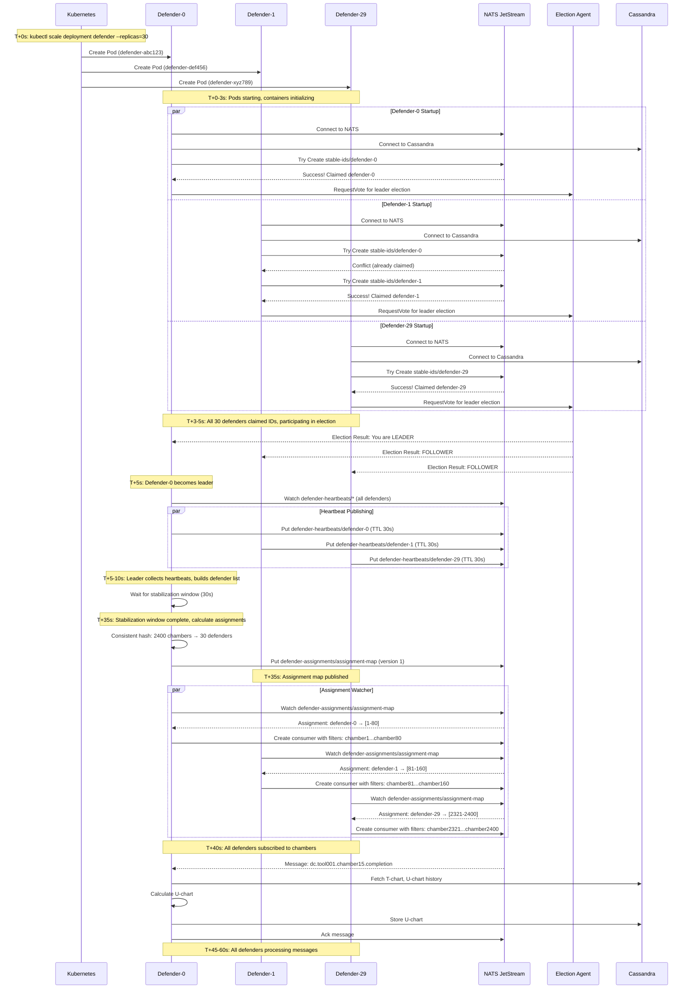

# Cold Start Scenario

## Scenario Overview

**Situation**: First deployment of the defender cluster (0 → 30 defenders)

**Objective**: All 30 defenders start, claim stable IDs, elect a leader, distribute 2400 chambers, and begin processing messages

**Timeline**: ~45-60 seconds from first pod creation to full operation

## Pre-Conditions

- NATS JetStream cluster running (3 nodes)
- Cassandra cluster running (3+ nodes)
- Election Agent running
- JetStream stream `dc-notifications` created
- KV buckets created: `stable-ids`, `defender-heartbeats`, `defender-assignments`
- Kubernetes Deployment ready: `kubectl apply -f defender-deployment.yaml`

## Sequence of Events



## Timeline Breakdown

### Phase 1: Pod Creation (T+0 to T+3s)

**Duration**: 0-3 seconds

**Activities**:
1. Kubernetes creates 30 ReplicaSet Pods
2. Pods scheduled to nodes (depends on node availability)
3. Container images pulled (if not cached)
4. Containers started
5. Defender processes begin initialization

**Metrics**:
- Pod creation rate: ~10 pods/second (typical)
- Image pull time: 0-5 seconds (if cached), 10-30 seconds (if not cached)

**Potential Issues**:
- Image pull rate limit (Docker Hub)
- Insufficient node resources
- Pod scheduling delays

### Phase 2: Stable ID Claiming (T+3 to T+5s)

**Duration**: 3-5 seconds (2 seconds)

**Activities**:
1. Each defender connects to NATS (100-200ms)
2. Each defender connects to Cassandra (100-200ms)
3. Sequential ID claiming (0.1-0.5s per defender)
   - Defender tries `Create` on `stable-ids/defender-0`, `defender-1`, etc.
   - First unclaimed ID is atomically claimed
   - Concurrent claims handled by NATS atomic operations

**Claiming Pattern**:
```
T+3.0s: Defenders 0-10 claim IDs (parallel attempts on defender-0)
T+3.1s: Defender-0 wins defender-0, others retry defender-1
T+3.2s: Defender-1 wins defender-1, others retry defender-2
...
T+5.0s: All 30 IDs claimed (defender-0 to defender-29)
```

**Metrics**:
- ID claim attempts: 30-60 total (some conflicts)
- ID claim time: 0.1-0.5s per successful claim
- Total claiming phase: ~2 seconds

### Phase 3: Leader Election (T+5 to T+5.5s)

**Duration**: 5-5.5 seconds (0.5 seconds)

**Activities**:
1. All 30 defenders call `RequestVote` on Election Agent
2. Election Agent selects leader (lowest stable ID with good health)
3. Election Agent returns leader/follower status to all defenders
4. Defender-0 (lowest ID) typically becomes leader

**Election Details**:
- Election latency: 100-500ms
- Leader selection criteria:
  - Lowest stable ID (defender-0 preferred)
  - Healthy heartbeat
  - Successfully connected to NATS and Cassandra

### Phase 4: Heartbeat Collection (T+5 to T+35s)

**Duration**: 5-35 seconds (30 seconds - stabilization window)

**Activities**:
1. **Leader** watches `defender-heartbeats/*` in NATS KV
2. **All defenders** publish heartbeats every 2 seconds
3. Leader builds list of active defenders
4. Leader waits for 30-second stabilization window
   - Ensures no more defenders are starting
   - Avoids premature assignment calculation

**Heartbeat Flow**:
```
T+5s:   Defenders publish first heartbeat
T+7s:   Defenders publish second heartbeat (30 defenders visible)
T+9s:   Defenders publish third heartbeat
...
T+35s:  Stabilization window complete, assignment calculation begins
```

**Metrics**:
- Heartbeat interval: 2 seconds
- Heartbeat TTL: 30 seconds
- Total heartbeats in window: ~450 heartbeats (30 defenders × 15 intervals)

### Phase 5: Assignment Calculation (T+35 to T+35.5s)

**Duration**: 35-35.5 seconds (0.5 seconds)

**Activities**:
1. Leader calculates consistent hash assignments
   - 2400 chambers distributed across 30 defenders
   - 150-200 virtual nodes per defender
   - ~80 chambers per defender
2. Leader creates assignment map (version 1)
3. Leader publishes to `defender-assignments/assignment-map`

**Assignment Distribution**:
```
Defender-0:  [1-80]       (80 chambers)
Defender-1:  [81-160]     (80 chambers)
Defender-2:  [161-240]    (80 chambers)
...
Defender-29: [2321-2400]  (80 chambers)
```

**Calculation Performance**:
- Hash calculation: 0.1-0.3 seconds (2400 chambers × 30 defenders)
- Assignment map serialization: 0.1-0.2 seconds (~50 KB JSON)
- KV write: 0.05-0.1 seconds

### Phase 6: Subscription Setup (T+35.5 to T+40s)

**Duration**: 35.5-40 seconds (4.5 seconds)

**Activities**:
1. **All defenders** watch `defender-assignments/assignment-map`
2. Each defender receives assignment
3. Each defender creates NATS consumer with filtered subjects
   - Example: Defender-0 assigned to tool001:chamber1, tool005:chamber2, tool012:chamber4, etc. (80 tool:chamber pairs)
   - Subscribes to `dc.tool001.chamber1.completion`, `dc.tool005.chamber2.completion`, `dc.tool012.chamber4.completion`, etc.
4. NATS starts delivering messages to consumers

**Subscription Pattern**:
```
T+36s: Defenders receive assignment map notification
T+37s: Defenders parse assignment, identify chambers
T+38s: Defenders create consumers with filter subjects (80 subjects each)
T+40s: All consumers ready, message delivery begins
```

**Metrics**:
- Consumer creation time: 0.5-1.5 seconds per defender
- Filter subjects per defender: 80
- Total consumers created: 30

### Phase 7: Message Processing (T+40s onward)

**Duration**: T+40s → steady state

**Activities**:
1. NATS delivers messages to defender consumers
2. Defenders fetch T-charts from Cassandra
3. Defenders fetch U-chart history from Cassandra (cache is empty initially)
4. Defenders calculate U-charts
5. Defenders store U-charts to Cassandra
6. Defenders update in-memory cache
7. Defenders acknowledge messages to NATS

**Initial Processing Characteristics**:
- **First message per chamber**: 3-5 seconds (cold cache, fetch T-chart + U-chart history)
- **Subsequent messages**: 1.2-1.5 seconds (cache hit)
- **Cache warm-up time**: 5-10 minutes (all 2400 chambers processed at least once)

**Metrics**:
- Initial process time: 3-5 seconds/message (cache miss)
- Steady-state process time: 1.2-1.5 seconds/message (cache hit)
- Cache hit rate (after 10 minutes): 95-98%

## Success Criteria

- ✅ All 30 defenders claim unique stable IDs (defender-0 to defender-29)
- ✅ Exactly 1 leader elected (typically defender-0)
- ✅ Assignment map published (version 1)
- ✅ All defenders receive assignments (~80 chambers each)
- ✅ All defenders create NATS consumers
- ✅ All 2400 chambers covered (no gaps)
- ✅ Message processing begins within 60 seconds

## Failure Scenarios

### Scenario 1: Defender Crashes During Startup

**Problem**: Defender-15 crashes at T+20s (during stabilization window)

**Impact**:
- ID `defender-15` claim expires after 30 seconds (T+50s)
- Leader detects heartbeat loss at T+50s
- Leader recalculates assignments at T+50s (29 defenders instead of 30)

**Recovery**:
- Kubernetes creates replacement pod
- New pod claims `defender-15` after TTL expires
- Appears as scale-up scenario (29→30)

### Scenario 2: Leader Crashes After Election

**Problem**: Defender-0 (leader) crashes at T+25s (before publishing assignment)

**Impact**:
- Election Agent detects leader failure
- New election triggered (defender-1 becomes leader)
- Stabilization window resets (30 more seconds)

**Recovery**:
- Defender-1 becomes leader at T+30s
- Defender-1 waits for stabilization window (T+30s → T+60s)
- Assignment published at T+60s

### Scenario 3: NATS Partition During Startup

**Problem**: NATS node-1 loses connectivity at T+10s

**Impact**:
- Defenders connected to node-1 reconnect to node-2 or node-3
- ID claims may be duplicated (both claim same ID)
- NATS clustering resolves conflicts (first claim wins)

**Recovery**:
- Conflicted defenders retry with next ID
- Stabilization window absorbs reconnection delays

## Observability

### Key Metrics to Monitor

| Metric | Expected Value | Alert Threshold |
|--------|----------------|-----------------|
| `defender_state{state="STABLE"}` | 30 (all defenders) | < 28 after 60s |
| `defender_is_leader` | 1 (sum across all) | != 1 after 10s |
| `defender_stable_id` | 0-29 (unique IDs) | Duplicates detected |
| `defender_assigned_chambers` | ~80 per defender | < 70 or > 90 |
| `defender_messages_processed_total` | Increasing | 0 after 60s |
| `nats_jetstream_consumer_ack_pending` | 0-10 per defender | > 50 |

### Log Messages to Expect

**Defender Logs**:
```
INFO  [T+3s]  defender-5: Connected to NATS
INFO  [T+3s]  defender-5: Connected to Cassandra
INFO  [T+3s]  defender-5: Claimed stable ID: defender-5
INFO  [T+5s]  defender-5: Election result: FOLLOWER (leader: defender-0)
INFO  [T+5s]  defender-5: State transition: CLAIMING_ID → ELECTION → FOLLOWER
INFO  [T+36s] defender-5: Received assignment map (version 1)
INFO  [T+36s] defender-5: Assigned 80 chambers: [401-480]
INFO  [T+38s] defender-5: Created NATS consumer with 80 filter subjects
INFO  [T+40s] defender-5: State transition: FOLLOWER → STABLE
INFO  [T+45s] defender-5: Processed message for chamber 450 (3.2s, cache miss)
```

**Leader Logs**:
```
INFO  [T+5s]  defender-0: Election result: LEADER
INFO  [T+5s]  defender-0: Starting assignment controller
INFO  [T+5s]  defender-0: Watching defender heartbeats
INFO  [T+7s]  defender-0: Detected 25 active defenders
INFO  [T+10s] defender-0: Detected 30 active defenders
INFO  [T+35s] defender-0: Stabilization window complete (30 defenders)
INFO  [T+35s] defender-0: Calculating chamber assignments (2400 chambers, 30 defenders)
INFO  [T+35s] defender-0: Assignment calculation complete (0.3s)
INFO  [T+35s] defender-0: Published assignment map (version 1, 30 defenders, 2400 chambers)
INFO  [T+40s] defender-0: State transition: LEADER → STABLE
```

## Related Scenarios

- [Scale-Up](./scale-up.md) - Adding defenders to running cluster
- [Scale-Down](./scale-down.md) - Removing defenders from running cluster
- [Crash Recovery](./crash-recovery.md) - Handling unexpected failures

## Related Documents

- [State Machine](../../03-architecture/state-machine.md)
- [High-Level Design](../../03-architecture/high-level-design.md)
- [Data Flow](../../03-architecture/data-flow.md)
