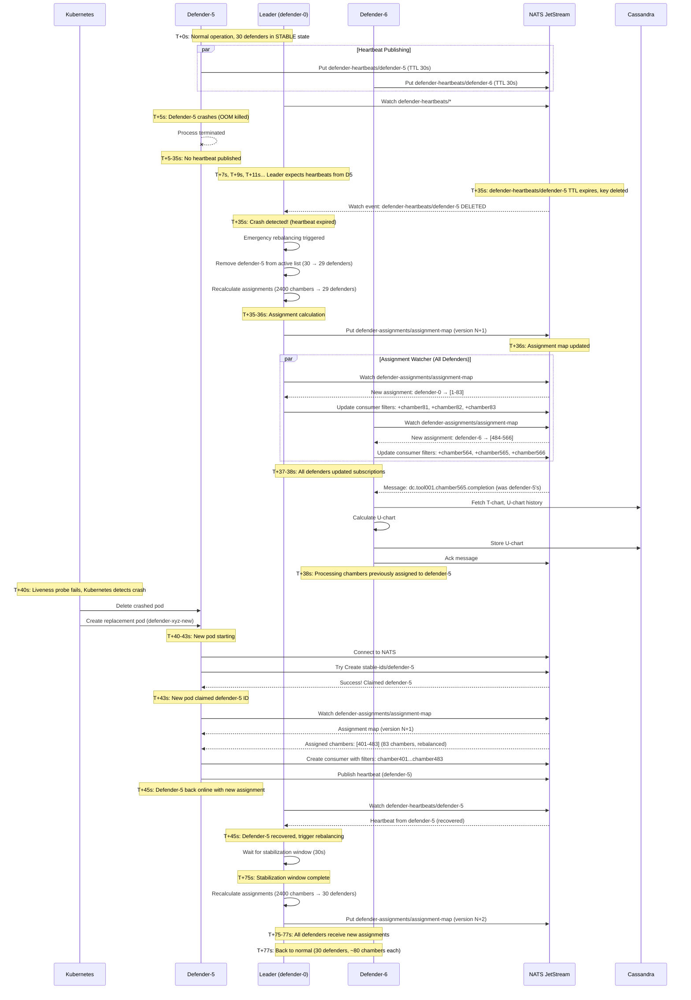

# Crash Recovery Scenario

## Scenario Overview

**Situation**: A defender crashes unexpectedly during normal operation

**Objective**: Detect crash, redistribute chambers to surviving defenders, restore to steady state

**Timeline**: ~8-10 seconds from crash to full recovery

**Key Mechanism**: Heartbeat TTL expiration triggers emergency rebalancing

## Pre-Conditions

- Cluster running: 30 defenders in STABLE state
- All defenders publishing heartbeats every 2 seconds
- Leader monitoring heartbeats via NATS KV watcher
- Assignment map stable (version N)

## Crash Types

### Type 1: Sudden Crash (OOM Kill, Segfault, Node Failure)

**Characteristics**:
- Process terminates immediately
- No graceful shutdown
- No stable ID release
- Heartbeat stops abruptly

**Detection Time**: 30 seconds (heartbeat TTL expiration)

### Type 2: Freeze/Deadlock

**Characteristics**:
- Process still running but unresponsive
- Cannot publish heartbeat
- Liveness probe fails after 30 seconds (3 × 10s intervals)

**Detection Time**: 30 seconds (heartbeat TTL expiration) or 30s (liveness probe)

### Type 3: Network Partition

**Characteristics**:
- Defender loses connectivity to NATS
- Cannot publish heartbeat
- Cannot receive assignments or messages

**Detection Time**: 30 seconds (heartbeat TTL expiration)

## Sequence of Events



## Timeline Breakdown

### Phase 1: Normal Operation (T+0 to T+5s)

**Activities**:
- All 30 defenders processing messages
- Heartbeats published every 2 seconds
- Leader monitoring heartbeats
- Assignment map stable (version N)

### Phase 2: Crash Occurs (T+5s)

**Event**: Defender-5 crashes (OOM killed, segfault, etc.)

**Immediate Impact**:
- Defender-5 process terminates
- No graceful shutdown
- Stable ID claim NOT released (no chance to delete)
- Heartbeat publishing stops

**Affected Resources**:
- 80 chambers previously assigned to defender-5
- Messages queued for defender-5 in NATS
- In-flight messages (1-5) lost (will be redelivered after ack timeout)

### Phase 3: Heartbeat Expiration (T+5 to T+35s)

**Activities**:
- Leader expects heartbeat from defender-5 at T+7s, T+9s, T+11s, ...
- No heartbeat received (defender-5 crashed)
- NATS KV entry `defender-heartbeats/defender-5` TTL counts down
- At T+35s (30s after last heartbeat), TTL expires

**Detection**:
```
Last heartbeat:  T+5s
TTL duration:    30 seconds
Expiration:      T+35s
```

**Leader Watches**:
```go
// Leader watches defender-heartbeats/* in NATS KV
watcher, _ := kv.WatchAll(nats.Context(ctx))
for entry := range watcher.Updates() {
    if entry == nil {
        // Key deleted (TTL expired)
        defenderID := extractDefenderID(entry.Key())
        handleDefenderCrash(defenderID)  // Emergency rebalancing
    }
}
```

### Phase 4: Emergency Rebalancing (T+35 to T+38s)

**Duration**: 2-3 seconds

**Activities**:

1. **Leader detects crash** (T+35s):
   - Watch event: `defender-heartbeats/defender-5` DELETED
   - Leader identifies defender-5 as crashed
   - Emergency rebalancing triggered (no stabilization window)

2. **Leader recalculates assignments** (T+35-36s):
   - Remove defender-5 from active defender list
   - Redistribute 2400 chambers across 29 defenders
   - Consistent hashing with 29 nodes
   - **Chamber redistribution**:
     - Most defenders: No change (consistent hashing locality)
     - Some defenders: Gain 2-3 additional chambers
     - Defender-5's 80 chambers distributed to ~10-15 nearby defenders

3. **Leader publishes new assignment** (T+36s):
   - Create new assignment map (version N+1)
   - Publish to `defender-assignments/assignment-map`

4. **All defenders update subscriptions** (T+36-38s):
   - Watch event: assignment map version N+1
   - Compare with current assignments
   - **Add chambers**: Update consumer filters (add new chamber subjects)
   - **Remove chambers**: Update consumer filters (remove old chamber subjects)
   - NATS starts/stops delivering messages to updated consumers

**Assignment Changes Example**:
```
Before (version N):
  defender-0:  [1-80]       (80 chambers)
  defender-5:  [401-480]    (80 chambers) ← CRASHED
  defender-6:  [481-560]    (80 chambers)

After (version N+1):
  defender-0:  [1-83]       (83 chambers) +3 from defender-5
  defender-5:  []           (0 chambers)  ← OFFLINE
  defender-6:  [481-566]    (86 chambers) +6 from defender-5
```

**Consistent Hashing Locality**:
- ~70-75 chambers from defender-5 redistributed to 2-3 nearest neighbors
- ~5-10 chambers redistributed to other defenders
- Most defenders (20-25) see no change

### Phase 5: Message Processing Resumes (T+38s onward)

**Activities**:
- Defenders with new chambers start receiving messages
- Messages previously queued for defender-5 delivered to new assignees
- **Cache behavior**:
  - New assignees likely have cold cache for defender-5's chambers
  - First message: 3-5 seconds (fetch U-chart history from Cassandra)
  - Subsequent messages: 1.2-1.5 seconds (cache hit)

**Message Redelivery**:
- In-flight messages from defender-5 (not acked) returned to NATS after 30s
- NATS redeliver to new assignees
- Defenders process messages (idempotency required)

### Phase 6: Kubernetes Detects Crash (T+40s)

**Activities**:
- Liveness probe fails (3 failures × 10s interval = 30s)
- Kubernetes deletes crashed pod
- Kubernetes creates replacement pod (ReplicaSet maintains desired count)

**Note**: Kubernetes detection (T+40s) is SLOWER than heartbeat TTL detection (T+35s)
- Leader already handled emergency rebalancing
- Kubernetes only responsible for pod replacement

### Phase 7: Defender-5 Recovers (T+40 to T+45s)

**Activities**:

1. **New pod starts** (T+40-43s):
   - Container image pull (if not cached)
   - Process initialization
   - Connect to NATS and Cassandra

2. **Claim stable ID** (T+43s):
   - Attempt `Create` on `stable-ids/defender-5`
   - Original claim expired (30s TTL, last heartbeat at T+5s)
   - Claim succeeds, new pod becomes defender-5

3. **Receive assignment** (T+43-44s):
   - Watch `defender-assignments/assignment-map` (version N+1)
   - Assigned chambers: [401-483] (83 chambers, more than original 80)
   - Some of original chambers may have moved to other defenders

4. **Subscribe to chambers** (T+44-45s):
   - Create NATS consumer with 83 filter subjects
   - Begin receiving messages

5. **Publish heartbeat** (T+45s):
   - First heartbeat published
   - Leader detects defender-5 recovery

### Phase 8: Stabilization and Rebalancing (T+45 to T+77s)

**Activities**:

1. **Leader detects recovery** (T+45s):
   - Watch event: `defender-heartbeats/defender-5` created
   - Leader adds defender-5 back to active list (29 → 30 defenders)
   - **Stabilization window triggered** (30 seconds)

2. **Stabilization window** (T+45-75s):
   - Leader waits 30 seconds for topology to stabilize
   - Ensures no more defenders joining/leaving
   - Prevents rapid rebalancing oscillations

3. **Final rebalancing** (T+75-76s):
   - Leader recalculates assignments (2400 chambers → 30 defenders)
   - Consistent hashing with 30 nodes (back to original topology)
   - Create new assignment map (version N+2)
   - Publish to NATS KV

4. **All defenders update subscriptions** (T+76-77s):
   - Receive assignment map version N+2
   - Update consumer filters
   - Back to ~80 chambers per defender

**Assignment Flow**:
```
T+0s:    Version N   (30 defenders, defender-5 has [401-480])
T+36s:   Version N+1 (29 defenders, defender-5's chambers redistributed)
T+76s:   Version N+2 (30 defenders, defender-5 has [401-480] again)
```

## Impact Analysis

### Message Processing Impact

**During Emergency Rebalancing (T+35-38s)**:
- **Downtime**: 2-3 seconds for defender-5's 80 chambers
- **Affected messages**: Messages queued for defender-5 during downtime
- **Recovery**: New assignees start processing at T+38s

**After Recovery (T+38s onward)**:
- **Cache cold start**: First message per chamber takes 3-5 seconds
- **Steady state**: Returns to 1.2-1.5 seconds after cache warm-up

### Chamber Movement Analysis

| Phase | Defenders | Affected Chambers | Reason |
|-------|-----------|-------------------|--------|
| Version N | 30 | 0 | Stable |
| Version N+1 (Emergency) | 29 | ~80 (defender-5's chambers) | Crash, emergency redistribution |
| Version N+2 (Recovery) | 30 | ~10-15 (consistent hashing locality) | Defender-5 back, rebalance to original |

**Total Chamber Movements**:
- Emergency rebalancing: 80 chambers (defender-5 → others)
- Recovery rebalancing: 10-15 chambers (others → defender-5)
- **Net impact**: ~90-95 chamber movements over 40 seconds

## Failure Scenarios

### Scenario 1: Multiple Defenders Crash Simultaneously

**Problem**: Defenders 5, 15, and 25 crash at T+5s

**Impact**:
- All 3 heartbeats expire at T+35s
- Leader detects 3 crashes simultaneously
- Emergency rebalancing: 2400 chambers → 27 defenders
- Each defender gains ~9 additional chambers

**Recovery**:
- Kubernetes creates 3 replacement pods
- Staggered startup: T+40s, T+42s, T+44s
- Stabilization window triggered after last recovery
- Final rebalancing: 27 → 28 → 29 → 30 defenders

### Scenario 2: Leader Crashes

**Problem**: Defender-0 (leader) crashes at T+5s

**Impact**:
- No heartbeat from defender-0
- Other defenders detect leader heartbeat expiration
- New election triggered (defender-1 becomes leader)
- New leader performs emergency rebalancing

**Recovery Timeline**:
```
T+5s:   Defender-0 crashes
T+35s:  Defender-0 heartbeat expires
T+35s:  Election triggered
T+36s:  Defender-1 becomes leader
T+36s:  Defender-1 performs emergency rebalancing (30 → 29 defenders)
T+40s:  Kubernetes creates replacement pod for defender-0
T+45s:  Defender-0 recovers, rejoins cluster
T+75s:  Final rebalancing (29 → 30 defenders)
```

### Scenario 3: Crash During Rebalancing

**Problem**: Defender-6 crashes at T+36s (during emergency rebalancing for defender-5)

**Impact**:
- Leader just published version N+1 (29 defenders)
- Defender-6 heartbeat expires at T+66s (30s after last heartbeat at T+36s)
- Leader performs second emergency rebalancing: 29 → 28 defenders
- Assignment map version N+2 published

**Recovery**:
- Multiple rebalancing rounds
- Stabilization window resets after each crash
- System eventually converges to stable state

## Success Criteria

- ✅ Crash detected within 30 seconds (heartbeat TTL)
- ✅ Emergency rebalancing completes within 3 seconds
- ✅ No message loss (NATS redelivery)
- ✅ Affected chambers resume processing within 5 seconds
- ✅ Kubernetes creates replacement pod
- ✅ Recovered defender reclaims original stable ID
- ✅ Final rebalancing restores original distribution

## Observability

### Key Metrics to Monitor

| Metric | Expected Behavior | Alert Threshold |
|--------|-------------------|-----------------|
| `defender_state{state="STABLE"}` | Drops by 1 (30→29) | < 28 for > 60s |
| `defender_is_leader` | Remains 1 (unless leader crashes) | 0 for > 5s |
| `defender_emergency_events_total` | Increments by 1 | > 3 per hour |
| `defender_rebalance_events_total` | Increments by 2 (emergency + recovery) | > 5 per hour |
| `defender_chamber_movements_total` | Increases by ~90 | > 500 per hour |
| `defender_messages_failed_total` | Slight increase (redeliveries) | Sustained increase |
| `nats_jetstream_consumer_ack_pending` | Spike during crash (queued messages) | > 100 per consumer |

### Log Messages to Expect

**Leader Logs (Crash Detection)**:
```
WARN  [T+35s] defender-0: Heartbeat expired: defender-5 (last seen: 30s ago)
ERROR [T+35s] defender-0: Defender crash detected: defender-5
INFO  [T+35s] defender-0: Emergency rebalancing triggered (30 → 29 defenders)
INFO  [T+36s] defender-0: Recalculating assignments (2400 chambers → 29 defenders)
INFO  [T+36s] defender-0: Assignment calculation complete (1.2s, 80 chambers moved)
INFO  [T+36s] defender-0: Published assignment map (version 16, emergency)
```

**Leader Logs (Recovery Detection)**:
```
INFO  [T+45s] defender-0: Defender recovered: defender-5
INFO  [T+45s] defender-0: Topology change: 29 → 30 defenders
INFO  [T+45s] defender-0: Stabilization window started (30s)
INFO  [T+75s] defender-0: Stabilization window complete
INFO  [T+75s] defender-0: Rebalancing triggered (30 defenders detected)
INFO  [T+76s] defender-0: Published assignment map (version 17, 30 defenders)
```

**Defender-5 Logs (Crash and Recovery)**:
```
# Old pod (before crash)
INFO  [T+5s]  defender-5: Processing message for chamber 450

# (crash occurs, no logs)

# New pod (after recovery)
INFO  [T+43s] defender-5: Starting defender v2.2.0
INFO  [T+43s] defender-5: Claimed stable ID: defender-5
INFO  [T+44s] defender-5: Received assignment map (version 16)
INFO  [T+44s] defender-5: Assigned 83 chambers: [401-483]
INFO  [T+45s] defender-5: Created NATS consumer with 83 filter subjects
INFO  [T+45s] defender-5: State transition: CLAIMING_ID → FOLLOWER → STABLE
```

## Related Scenarios

- [Cold Start](./cold-start.md) - Initial cluster startup
- [Scale-Down](./scale-down.md) - Graceful defender removal
- [Rolling Update](./rolling-update.md) - Zero-rebalancing version upgrade

## Related Documents

- [State Machine - EMERGENCY State](../../03-architecture/state-machine.md#5-emergency-state)
- [High-Level Design - Fault Tolerance](../../03-architecture/high-level-design.md)
- [Design Decisions - Decision #2](../../03-architecture/design-decisions.md#decision-2-assignment-control-leader-driven-centralized-assignment)
