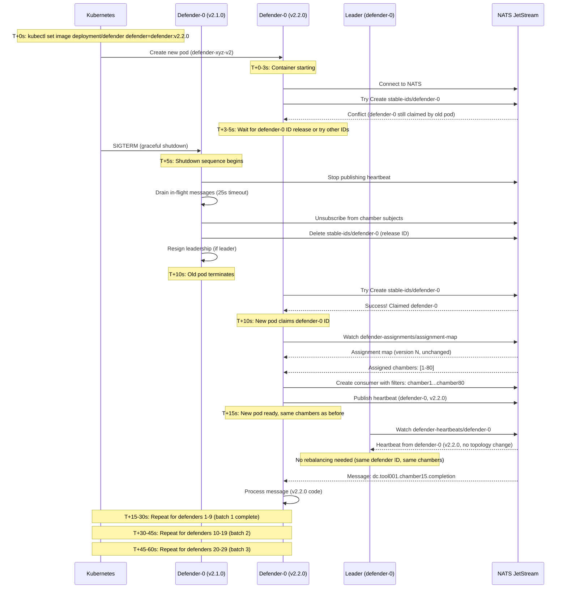

# Rolling Update Scenario

## Scenario Overview

**Situation**: Deploying a new defender version (v2.1.0 → v2.2.0) with zero chamber reassignment

**Objective**: Replace all 30 defenders with new version while maintaining 100% availability and avoiding rebalancing

**Timeline**: ~30-75 seconds depending on strategy (surge vs. sequential)

**Key Innovation**: Stable IDs enable zero-reassignment updates (new pod claims same ID = same chamber assignments)

## Pre-Conditions

- Cluster running: 30 defenders (v2.1.0) in STABLE state
- New image available: `defender:v2.2.0`
- Rolling update strategy configured in Deployment
- Assignment map stable (version N)

## Kubernetes Rolling Update Configuration

### Strategy 1: Surge Strategy (Recommended)

**Configuration**:
```yaml
apiVersion: apps/v1
kind: Deployment
metadata:
  name: defender
spec:
  replicas: 30
  strategy:
    type: RollingUpdate
    rollingUpdate:
      maxSurge: 10       # Allow 10 extra pods during update
      maxUnavailable: 0  # Zero unavailability
  template:
    spec:
      containers:
      - name: defender
        image: defender:v2.2.0
        lifecycle:
          preStop:
            exec:
              command: ["/bin/sh", "-c", "sleep 5"]  # Grace period
      terminationGracePeriodSeconds: 30
```

**Timeline**: ~30-40 seconds

**Behavior**:
1. Kubernetes creates 10 new pods (v2.2.0)
2. New pods claim stable IDs from old pods (IDs 0-9)
3. Wait for new pods to be ready
4. Kubernetes terminates 10 old pods (v2.1.0)
5. Repeat for next batch (IDs 10-19, then 20-29)

### Strategy 2: Sequential Strategy

**Configuration**:
```yaml
apiVersion: apps/v1
kind: Deployment
metadata:
  name: defender
spec:
  replicas: 30
  strategy:
    type: RollingUpdate
    rollingUpdate:
      maxSurge: 0        # No extra pods
      maxUnavailable: 5  # Replace 5 at a time
  template:
    spec:
      containers:
      - name: defender
        image: defender:v2.2.0
      terminationGracePeriodSeconds: 30
```

**Timeline**: ~60-75 seconds

**Behavior**:
1. Kubernetes terminates 5 old pods (v2.1.0)
2. Released stable IDs become available (after 30s TTL)
3. Kubernetes creates 5 new pods (v2.2.0)
4. New pods claim released stable IDs
5. Repeat for next batch (6 batches total)

## Sequence of Events (Surge Strategy)



## Timeline Breakdown (Surge Strategy)

### Batch 1: Defenders 0-9 (T+0 to T+15s)

**T+0s**: Kubernetes creates 10 new pods (v2.2.0)

**T+0-5s**: New pods initialize
- Connect to NATS and Cassandra
- Attempt to claim IDs (defender-0 to defender-9)
- IDs still claimed by old pods, conflicts expected

**T+5s**: Kubernetes sends SIGTERM to 10 old pods

**T+5-10s**: Old pods graceful shutdown
- Stop publishing heartbeats
- Drain in-flight messages (up to 25 seconds)
- Unsubscribe from chamber subjects
- Release stable IDs (Delete from NATS KV)
- Terminate

**T+10s**: Old pods terminated, IDs available

**T+10-12s**: New pods claim released IDs
- Atomic `Create` operations on `stable-ids/defender-N`
- First come, first served (but typically sequential)

**T+12-15s**: New pods subscribe to chambers
- Fetch assignment map (version N, unchanged)
- Same chambers as old pods had
- Create NATS consumers with same filter subjects
- Begin processing messages

**T+15s**: Batch 1 complete (defenders 0-9 on v2.2.0)

**Leader observes**:
- 10 heartbeats change version tag (v2.1.0 → v2.2.0)
- No topology change (same 30 defenders)
- No rebalancing triggered

### Batch 2: Defenders 10-19 (T+15 to T+30s)

**Identical process to Batch 1, offset by 15 seconds**

### Batch 3: Defenders 20-29 (T+30 to T+45s)

**Identical process to Batch 1, offset by 30 seconds**

### Total Time: ~45 seconds (3 batches × 15 seconds)

## Leader Handling

### Scenario 1: Leader is NOT in First Batch

**Example**: Leader is defender-15

**Behavior**:
- Batches 1 and 2 complete normally
- Leader remains on v2.1.0, continues assignment management
- Batch 3 includes defender-15
- Leader gracefully resigns before shutdown
- New election triggered (defender-16 likely becomes leader)
- New leader is on v2.2.0, continues with same assignment map

**Impact**: Brief leadership transition (~0.5-1s), no rebalancing

### Scenario 2: Leader IS in First Batch

**Example**: Leader is defender-5

**Behavior**:
- Leader receives SIGTERM in Batch 1
- Leader resigns leadership gracefully
- New election triggered immediately (defender-10 likely becomes leader)
- New leader is on v2.1.0, continues with same assignment map
- Eventually, new leader is also replaced in Batch 2

**Impact**: Two leadership transitions (v2.1.0 → v2.1.0 → v2.2.0), no rebalancing

## Zero-Reassignment Guarantee

### Why No Rebalancing?

1. **Stable ID Reuse**: New pod claims same ID as old pod
   - `defender-5 (v2.1.0)` → `defender-5 (v2.2.0)`
   - Same ID = Same chambers (consistent hash input unchanged)

2. **Assignment Map Unchanged**: Leader sees no topology change
   - Same 30 defenders
   - Same stable IDs
   - Same heartbeat count
   - Assignment map version remains at N

3. **No Stabilization Window**: Update is gradual (5-10 defenders at a time)
   - Leader sees continuous 30 heartbeats
   - No sudden topology change
   - No 30-second stabilization window triggered

### Comparison with StatefulSet

| Approach | Rebalancing? | Reason |
|----------|--------------|--------|
| **StatefulSet** | ❌ Yes | New pods get new identities (defender-30, defender-31, ...) during surge, triggering rebalancing |
| **Deployment + Stable IDs** | ✅ No | New pods reuse old stable IDs (defender-0, defender-1, ...), no topology change |

## Failure Scenarios

### Scenario 1: New Pod Crashes During Startup

**Problem**: New pod (v2.2.0) crashes at T+12s after claiming defender-5

**Impact**:
- Stable ID `defender-5` claim expires after 30 seconds
- Leader detects heartbeat loss at T+42s
- Leader triggers emergency rebalancing (29 defenders)

**Recovery**:
- Kubernetes creates replacement pod
- New pod claims `defender-5` after TTL expires
- Appears as crash recovery, not rolling update

### Scenario 2: Old Pod Fails to Drain Messages

**Problem**: Old pod has 15 in-flight messages, draining exceeds 25-second timeout

**Impact**:
- Kubernetes sends SIGKILL at T+30s (terminationGracePeriodSeconds)
- Pod terminated forcefully
- In-flight messages return to NATS (ack timeout 30s)
- New pod processes redelivered messages

**Recovery**:
- No data loss (NATS redelivery)
- Messages processed twice (idempotency required in defense logic)

### Scenario 3: Assignment Map Conflict

**Problem**: Leader calculates new assignment during rolling update (e.g., due to crash in another defender)

**Impact**:
- Assignment map version increments (N → N+1)
- Some defenders on v2.1.0, some on v2.2.0
- All defenders adapt to new assignment (same behavior regardless of version)

**Recovery**:
- Both versions compatible with assignment protocol
- No impact on rolling update

## Success Criteria

- ✅ All 30 defenders replaced (v2.1.0 → v2.2.0)
- ✅ Zero chamber reassignments (assignment map version unchanged)
- ✅ Zero message loss (NATS redelivery for any failures)
- ✅ 100% availability (maxUnavailable: 0 in surge strategy)
- ✅ No rebalancing triggered (leader sees continuous 30 heartbeats)
- ✅ Completion time: < 60 seconds (surge strategy)

## Observability

### Key Metrics to Monitor

| Metric | Expected Behavior | Alert Threshold |
|--------|-------------------|-----------------|
| `defender_version{version="v2.2.0"}` | Increasing (0→30) | Stalled for > 5 minutes |
| `defender_assignment_version` | **Unchanged** (version N) | Incremented during update |
| `defender_rebalance_events_total` | **0 (no increase)** | > 0 during update |
| `defender_chamber_movements_total` | **0 (no increase)** | > 0 during update |
| `defender_messages_processed_total` | Continuous increase | Drops to 0 |
| `defender_state{state="STABLE"}` | Remains ~30 | < 25 for > 30s |

### Log Messages to Expect

**Old Pod (v2.1.0) Shutdown**:
```
INFO  [T+5s]  defender-5: Received SIGTERM, initiating graceful shutdown
INFO  [T+5s]  defender-5: Stopping message processing
INFO  [T+5s]  defender-5: Draining 8 in-flight messages (timeout: 25s)
INFO  [T+7s]  defender-5: All messages drained (2.1s)
INFO  [T+7s]  defender-5: Unsubscribing from 80 chamber subjects
INFO  [T+8s]  defender-5: Releasing stable ID: defender-5
INFO  [T+8s]  defender-5: Closing NATS connection
INFO  [T+8s]  defender-5: Closing Cassandra connection
INFO  [T+9s]  defender-5: Shutdown complete
```

**New Pod (v2.2.0) Startup**:
```
INFO  [T+10s] defender-5: Starting defender v2.2.0
INFO  [T+11s] defender-5: Connected to NATS
INFO  [T+11s] defender-5: Connected to Cassandra
INFO  [T+11s] defender-5: Claimed stable ID: defender-5
INFO  [T+12s] defender-5: Election result: FOLLOWER (leader: defender-0)
INFO  [T+13s] defender-5: Received assignment map (version N)
INFO  [T+13s] defender-5: Assigned 80 chambers: [401-480]
INFO  [T+14s] defender-5: Created NATS consumer with 80 filter subjects
INFO  [T+15s] defender-5: State transition: FOLLOWER → STABLE
INFO  [T+16s] defender-5: Processed message for chamber 450 (1.3s, cache hit)
```

**Leader Logs**:
```
INFO  [T+15s] defender-0: Detected version change: defender-5 v2.1.0 → v2.2.0
INFO  [T+15s] defender-0: Topology unchanged: 30 defenders, 2400 chambers
INFO  [T+15s] defender-0: No rebalancing needed (stable topology)
INFO  [T+30s] defender-0: Rolling update progress: 10/30 defenders on v2.2.0
INFO  [T+45s] defender-0: Rolling update progress: 20/30 defenders on v2.2.0
INFO  [T+60s] defender-0: Rolling update complete: 30/30 defenders on v2.2.0
```

## Related Scenarios

- [Blue-Green Deployment](./blue-green.md) - Zero-downtime with parallel clusters
- [Canary Deployment](./canary.md) - Gradual rollout with testing
- [Crash Recovery](./crash-recovery.md) - Handling unexpected failures

## Related Documents

- [High-Level Design - Scaling Behavior](../../03-architecture/high-level-design.md#scaling-behavior)
- [Design Decisions - Decision #6](../../03-architecture/design-decisions.md#decision-6-kubernetes-workload-deployment-with-self-assigned-stable-ids-hybrid-approach)
- [Constraints - Deployment Strategies](../../01-requirements/constraints.md#deployment-strategy-requirements)
