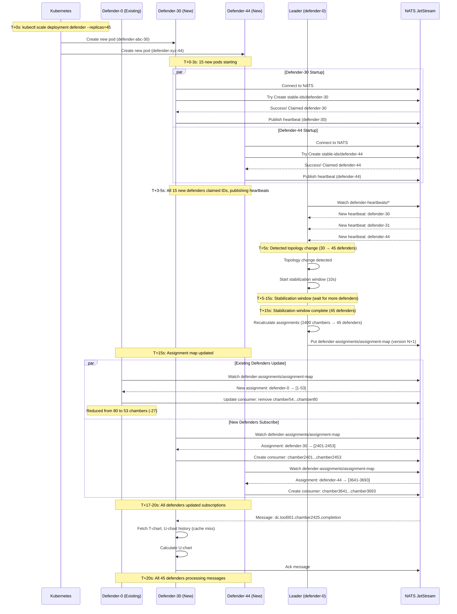

# Scale-Up Scenario

## Scenario Overview

**Situation**: Increasing cluster size to handle higher load (30 → 45 defenders)

**Objective**: Add 15 new defenders, redistribute chambers, maintain processing continuity

**Timeline**: ~20 seconds from scale command to full operation

**Trigger**: Manual scaling or Horizontal Pod Autoscaler (HPA)

## Pre-Conditions

- Cluster running: 30 defenders in STABLE state
- Assignment map stable (version N)
- All 2400 chambers being processed
- Average load: 60-70% CPU per defender

## Scaling Command

### Manual Scaling
```bash
kubectl scale deployment defender --replicas=45 -n fdc-system
```

### Horizontal Pod Autoscaler (HPA)
```yaml
apiVersion: autoscaling/v2
kind: HorizontalPodAutoscaler
metadata:
  name: defender-hpa
  namespace: fdc-system
spec:
  scaleTargetRef:
    apiVersion: apps/v1
    kind: Deployment
    name: defender
  minReplicas: 20
  maxReplicas: 60
  metrics:
  - type: Resource
    resource:
      name: cpu
      target:
        type: Utilization
        averageUtilization: 70  # Scale up when CPU > 70%
  - type: Resource
    resource:
      name: memory
      target:
        type: Utilization
        averageUtilization: 75  # Scale up when memory > 75%
  behavior:
    scaleUp:
      stabilizationWindowSeconds: 120  # Wait 2 minutes before scaling up
      policies:
      - type: Percent
        value: 50               # Max 50% increase per step
        periodSeconds: 60
      - type: Pods
        value: 15               # Max 15 pods per step
        periodSeconds: 60
      selectPolicy: Min         # Use minimum of the two policies
```

## Sequence of Events



## Timeline Summary

**Total Duration**: ~20 seconds (vs. 45-60s for cold start)

| Phase | Time Range | Duration | Activity |
|-------|-----------|----------|----------|
| Pod Creation | T+0 to T+3s | 3s | Kubernetes creates 15 new pods |
| ID Claiming | T+3 to T+5s | 2s | New defenders claim stable IDs |
| Detection | T+5s | <0.1s | Leader detects topology change |
| Stabilization | T+5 to T+15s | 10s | Wait for cluster to stabilize |
| Calculation | T+15 to T+16s | 1s | Calculate new assignments |
| Subscription Update | T+16 to T+18s | 2s | Defenders update subscriptions |
| Processing | T+18s+ | - | All defenders processing messages |

## Timeline Breakdown

### Phase 1: Pod Creation (T+0 to T+3s)

**Duration**: 0-3 seconds

**Activities**:
1. Kubernetes receives scale command
2. ReplicaSet controller creates 15 new pods
3. Pods scheduled to nodes (depends on node availability)
4. Container images pulled (if not cached)
5. Containers started
6. Defender processes begin initialization

**Metrics**:
- Pod creation rate: ~10 pods/second (typical)
- Image pull time: 0-5 seconds (if cached)

### Phase 2: Stable ID Claiming (T+3 to T+5s)

**Duration**: 3-5 seconds (2 seconds)

**Activities**:
1. New defenders connect to NATS and Cassandra
2. Sequential ID claiming:
   - Defender tries `Create` on `stable-ids/defender-30`
   - If success, ID claimed; if conflict, try next ID
   - IDs defender-30 to defender-44 available (no conflicts expected)
3. New defenders publish first heartbeats

**ID Claiming Pattern**:
```
T+3.0s: New defenders attempt to claim IDs
T+3.1s: Defender-30 claims defender-30
T+3.2s: Defender-31 claims defender-31
...
T+5.0s: All 15 new IDs claimed (defender-30 to defender-44)
```

### Phase 3: Leader Detection (T+5s)

**Duration**: Immediate (< 0.1s)

**Activities**:
1. Leader watches `defender-heartbeats/*` in NATS KV
2. Leader detects 15 new heartbeat entries
3. Leader identifies topology change (30 → 45 defenders)
4. **Stabilization window triggered** (10 seconds for planned scale)

**Leader Logic**:
```go
// Leader watches heartbeat KV bucket
watcher, _ := kv.WatchAll(nats.Context(ctx))
for entry := range watcher.Updates() {
    if entry != nil && entry.Operation() == nats.KeyValuePut {
        defenderID := extractDefenderID(entry.Key())

        // New defender joined
        if !activeDefenders.Contains(defenderID) {
            log.Infof("New defender detected: %s", defenderID)
            activeDefenders.Add(defenderID)

            // Trigger stabilization window
            // 10 seconds for planned scale (not cold start)
            stabilizationTimer.Reset(10 * time.Second)
        }
    }
}
```

### Phase 4: Stabilization Window (T+5 to T+15s)

**Duration**: 5-15 seconds (10 seconds)

**Purpose**: Ensure no more defenders are starting before rebalancing

**Activities**:
1. Leader waits for 10 seconds (planned scale window)
2. All 45 defenders continuously publish heartbeats every 2 seconds
3. Leader monitors heartbeat count
4. If more defenders join during window, timer resets

**Heartbeat Count Evolution**:
```
T+5s:   30 defenders (existing) + 15 defenders (new) = 45
T+7s:   45 defenders
T+9s:   45 defenders
T+11s:  45 defenders
T+13s:  45 defenders
T+15s:  45 defenders (stable for 10 seconds)
```

**Why 10 seconds?**
- Fast response for planned scale operations
- Still batches small bursts of pod creation
- Balances responsiveness vs. calculation efficiency
- Different from cold start (30s) which handles 0→many defenders

### Phase 5: Assignment Calculation (T+15 to T+16s)

**Duration**: 15-16 seconds (1 second)

**Activities**:
1. Leader calculates consistent hash assignments
   - 2400 chambers distributed across 45 defenders
   - 150-200 virtual nodes per defender
   - ~53 chambers per defender (2400 / 45 = 53.3)
2. Leader creates assignment map (version N+1)
3. Leader publishes to `defender-assignments/assignment-map`

**Assignment Distribution Changes**:
```
Before (version N, 30 defenders):
  Defender-0:  [1-80]       (80 chambers)
  Defender-1:  [81-160]     (80 chambers)
  ...
  Defender-29: [2321-2400]  (80 chambers)

After (version N+1, 45 defenders):
  Defender-0:  [1-53]       (53 chambers)  -27 chambers
  Defender-1:  [54-106]     (53 chambers)  -27 chambers
  ...
  Defender-29: [1538-1590]  (53 chambers)  -27 chambers
  Defender-30: [1591-1643]  (53 chambers)  NEW
  Defender-31: [1644-1696]  (53 chambers)  NEW
  ...
  Defender-44: [2348-2400]  (53 chambers)  NEW
```

**Chamber Movements**:
- **Total movements**: ~1000 chambers (based on consistent hashing redistribution)
- **Locality preserved**: 60-70% of chambers stay with original defenders
- **New defenders**: Receive chambers from multiple existing defenders (distributed load reduction)

### Phase 6: Subscription Updates (T+36 to T+40s)

**Duration**: 36-40 seconds (4 seconds)

**Activities**:

#### Existing Defenders (defender-0 to defender-29)
1. Watch assignment map update notification
2. Compare new assignment with current assignment
3. **Remove chambers** (27 chambers on average):
   - Update NATS consumer: Remove filter subjects
   - NATS stops delivering messages for removed chambers
4. Continue processing remaining chambers

#### New Defenders (defender-30 to defender-44)
1. Watch assignment map update notification
2. Receive first assignment (53 chambers)
3. **Add chambers** (53 chambers):
   - Create NATS consumer with filter subjects
   - NATS starts delivering messages
4. Begin processing messages

**Subscription Update Pattern**:
```go
// Existing defender (defender-0)
oldAssignment := map[string]string{
    "tool001:chamber1": "defender-0",
    "tool005:chamber2": "defender-0",
    // ... (80 tool:chamber pairs)
}
newAssignment := map[string]string{
    "tool001:chamber1": "defender-0",
    "tool005:chamber2": "defender-0",
    // ... (53 tool:chamber pairs, 27 removed)
}

// Remove subscriptions for reassigned chambers
for toolChamber := range oldAssignment {
    if newAssignment[toolChamber] != "defender-0" {
        parts := strings.Split(toolChamber, ":")
        subject := fmt.Sprintf("dc.%s.%s.completion", parts[0], parts[1])
        consumer.RemoveFilter(subject)
    }
}

// New defender (defender-30)
newAssignment := map[string]string{
    "tool050:chamber3": "defender-30",
    "tool102:chamber1": "defender-30",
    // ... (53 tool:chamber pairs)
}

for toolChamber, defenderID := range newAssignment {
    if defenderID == "defender-30" {
        parts := strings.Split(toolChamber, ":")
        subject := fmt.Sprintf("dc.%s.%s.completion", parts[0], parts[1])
        consumer.AddFilter(subject)
    }
}
```

### Phase 7: Message Processing (T+40s onward)

**Duration**: T+40s → steady state

**Activities**:
1. All 45 defenders processing messages
2. **New defenders**: Initial processing slower (cold cache)
   - First message per chamber: 3-5 seconds (fetch U-chart history from Cassandra)
   - Subsequent messages: 1.2-1.5 seconds (cache hit)
3. **Existing defenders**: Reduced load (80 → 53 chambers, ~34% reduction)
   - CPU utilization drops: 70% → 50%
   - Memory usage drops: 12 GB → 8 GB

**Load Redistribution**:
```
Before scale-up (30 defenders):
  Average load: 80 chambers/defender, 70% CPU, 12 GB memory

After scale-up (45 defenders):
  Average load: 53 chambers/defender, 50% CPU, 8 GB memory
  Load reduction: 34%
```

## Impact Analysis

### Chamber Redistribution

**Consistent Hashing Locality**:
- ~1400 chambers stay with original defenders (60%)
- ~1000 chambers move to new defenders or different existing defenders (40%)

**Movement Pattern**:
```
Defender-0:  Loses chambers 54-80  (27 chambers) → distributed to defender-30, defender-31, ...
Defender-1:  Loses chambers 134-160 (27 chambers) → distributed to defender-32, defender-33, ...
...
Defender-29: Loses chambers 2374-2400 (27 chambers) → distributed to defender-42, defender-43, defender-44
```

### Message Processing Impact

**During Subscription Update (T+36-40s)**:
- **Removed chambers**: Messages queued in NATS (not yet delivered to new assignees)
- **New chambers**: New defenders start receiving messages
- **Message latency**: Brief spike (2-4 seconds) during subscription update

**After Subscription Update (T+40s onward)**:
- **Existing defenders**: Immediate benefit (reduced load)
- **New defenders**: Cold cache, initial processing slower
- **Overall throughput**: Slight dip initially, then increases as cache warms up

## Success Criteria

- ✅ All 15 new defenders claim unique stable IDs (defender-30 to defender-44)
- ✅ Stabilization window completes (30 seconds)
- ✅ Assignment map updated (version N+1)
- ✅ All 45 defenders receive assignments (~53 chambers each)
- ✅ All 2400 chambers covered (no gaps)
- ✅ Chamber redistribution completes within 40 seconds
- ✅ CPU utilization reduced on existing defenders (~34% reduction)

## Failure Scenarios

### Scenario 1: New Defender Crashes During Startup

**Problem**: Defender-35 crashes at T+20s (during stabilization window)

**Impact**:
- ID `defender-35` claim expires after 30 seconds (T+50s)
- Leader detects heartbeat loss
- Stabilization window continues with 44 defenders

**Recovery**:
- Kubernetes creates replacement pod
- New pod claims `defender-35` after TTL expires
- May appear as separate scale-up event if beyond stabilization window

### Scenario 2: Insufficient Resources

**Problem**: Kubernetes cannot schedule all 15 new pods (node capacity exhausted)

**Impact**:
- Only 10 pods scheduled (defender-30 to defender-39)
- Remaining 5 pods pending
- Leader sees 40 defenders after stabilization window

**Recovery**:
- Leader calculates assignments for 40 defenders (~60 chambers each)
- Cluster operates with 40 defenders
- Pending pods scheduled later, triggers another scale-up event

### Scenario 3: ID Conflict

**Problem**: Defender-30 already claimed (stale claim from previous crash)

**Impact**:
- New defender tries defender-30, gets conflict
- New defender retries with defender-31, defender-32, ...
- Eventually finds available ID

**Recovery**:
- All new defenders eventually claim IDs (may not be sequential)
- Stabilization window absorbs ID claiming delays

## Observability

### Key Metrics to Monitor

| Metric | Expected Behavior | Alert Threshold |
|--------|-------------------|-----------------|
| `defender_state{state="STABLE"}` | 30 → 45 | < 42 after 60s |
| `defender_assignment_version` | Increments by 1 | No change after 60s |
| `defender_rebalance_events_total` | Increments by 1 | > 2 during scale-up |
| `defender_chamber_movements_total` | Increases by ~1000 | > 1500 |
| `defender_assigned_chambers` | 80 → 53 per defender | < 40 or > 70 |
| `defender_messages_processed_total` | Continuous increase | Sustained drop |
| `defender_process_time_seconds` p99 | Spike during scale-up | > 10s for > 5m |

### Log Messages to Expect

**Leader Logs**:
```
INFO  [T+5s]  defender-0: New defender detected: defender-30
INFO  [T+5s]  defender-0: New defender detected: defender-31
...
INFO  [T+5s]  defender-0: Topology change: 30 → 45 defenders
INFO  [T+5s]  defender-0: Stabilization window started (30s)
INFO  [T+35s] defender-0: Stabilization window complete (45 defenders)
INFO  [T+35s] defender-0: Rebalancing triggered (scale-up detected)
INFO  [T+35s] defender-0: Recalculating assignments (2400 chambers → 45 defenders)
INFO  [T+36s] defender-0: Assignment calculation complete (0.8s, 1012 chambers moved)
INFO  [T+36s] defender-0: Published assignment map (version 17, 45 defenders)
```

**Existing Defender Logs (defender-0)**:
```
INFO  [T+36s] defender-0: Received assignment map (version 17)
INFO  [T+36s] defender-0: Assignment changed: 80 → 53 chambers
INFO  [T+36s] defender-0: Removing 27 chambers: [54-80]
INFO  [T+37s] defender-0: Updated NATS consumer (removed 27 filter subjects)
INFO  [T+37s] defender-0: Current load: 53 chambers, CPU: 50%, Memory: 8.2 GB
```

**New Defender Logs (defender-30)**:
```
INFO  [T+3s]  defender-30: Starting defender v2.2.0
INFO  [T+3s]  defender-30: Claimed stable ID: defender-30
INFO  [T+4s]  defender-30: Election result: FOLLOWER (leader: defender-0)
INFO  [T+36s] defender-30: Received assignment map (version 17)
INFO  [T+36s] defender-30: Assigned 53 chambers: [1591-1643]
INFO  [T+37s] defender-30: Created NATS consumer with 53 filter subjects
INFO  [T+38s] defender-30: State transition: FOLLOWER → STABLE
INFO  [T+42s] defender-30: Processed message for chamber 1600 (3.8s, cache miss)
INFO  [T+45s] defender-30: Processed message for chamber 1605 (1.3s, cache hit)
```

## Related Scenarios

- [Cold Start](./cold-start.md) - Initial cluster startup (0 → 30)
- [Scale-Down](./scale-down.md) - Reducing cluster size (30 → 20)
- [Crash Recovery](./crash-recovery.md) - Handling unexpected failures

## Related Documents

- [High-Level Design - Scaling Behavior](../../03-architecture/high-level-design.md#scaling-behavior)
- [Constraints - Scalability Requirements](../../01-requirements/constraints.md#scalability-requirements)
- [State Machine - SCALING State](../../03-architecture/state-machine.md#7-scaling-state)
