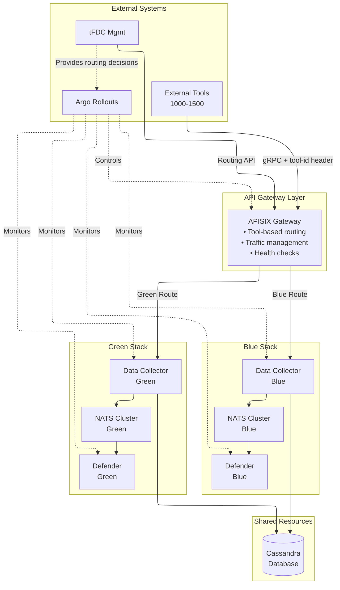
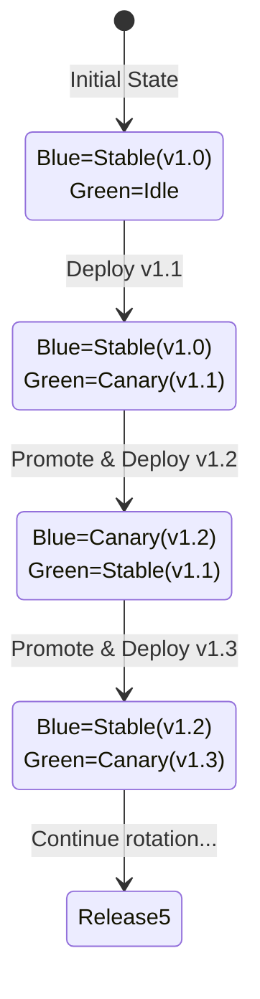
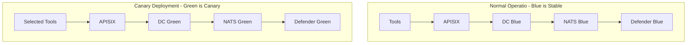
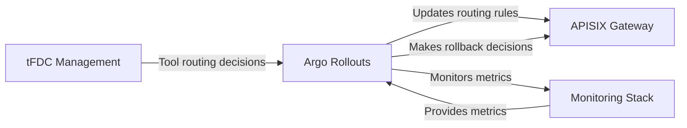
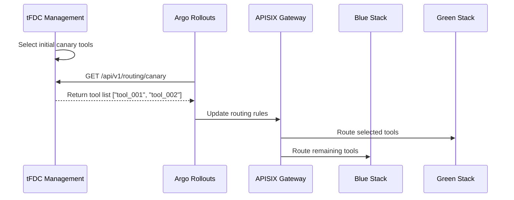
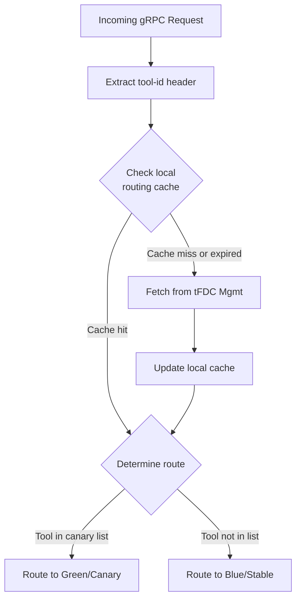
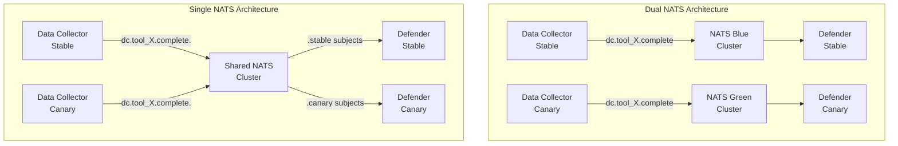
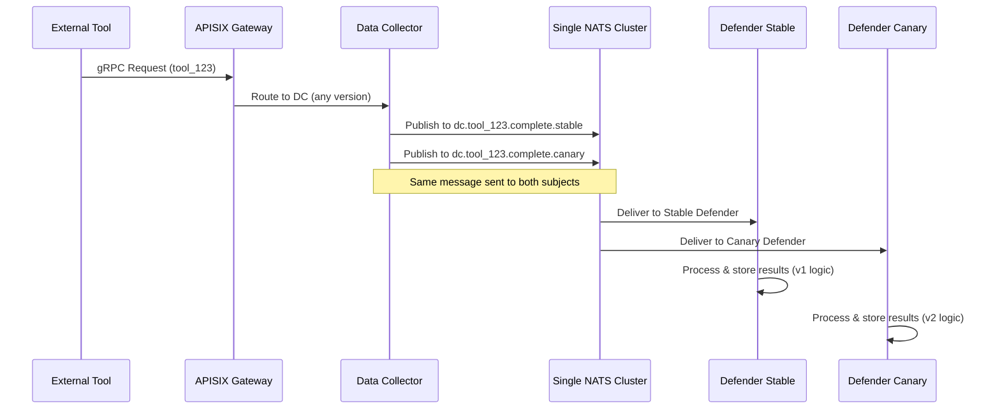
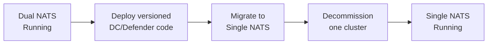

# Introduction

This document describes the existing architecture of the tFDC product and proposes a robust deployment strategy that leverages a combination of Blue/Green and canary release patterns. The goal is to enable seamless, zero-downtime updates with the ability to progressively shift traffic on a per-tool basis and ensure easy rollback capabilities.

The tFDC product consists of three primary components: a Data Collector, a Defender service, and a NATS Jetstream cluster for inter-service communication and state management.

# Current tFDC Architecture Overview

The tFDC system is designed to collect, process, and analyze time-series data from numerous external tools.

## Components

### Data Collector Service

- Function: A stateless service responsible for receiving time-series data via gRPC from 1000-1500 external tools.
- Data Handling: Stores received time-series data into a Cassandra database upon gRPC request. Each request contains N metrics with three data points over a time range.
- Event Notification: When a tool signals the completion of a collection cycle (a "Context"), the Data Collector sends a notification message to the Defender service via NATS Jetstream. The NATS subject for these notifications is tool-specific, following the pattern `dc.<tool_id>.complete`.
- Deployment: Deployed as a Kubernetes Deployment, supporting Horizontal Pod Autoscaling (HPA).
- Communication: Exposes a gRPC endpoint to external tools.

### Defender Service

- Function: A stateless service responsible for processing data collection completion notifications from the Data Collector.
- Scalability & Resilience: Supports HPA and incorporates its own leader election mechanism.
- Subject Assignment: The elected leader is responsible for assigning NATS subjects to Defender replicas using consistent hashing to balance workload. For example, 1000 `dc.tool_X.complete` subjects are distributed among 50 Defender replicas.
- Stable Identity: Deployed as a K8s Deployment, but maintains stable identity by leveraging the NATS KV store for leader election, replica heartbeats, and subject assignments.
- Subscription Model: Each Defender replica subscribes to its assigned subjects with a durable consumer, using one dedicated durable consumer per subject.

### NATS Jetstream Cluster

- Function: Provides a high-performance, reliable messaging backbone for the tFDC system.

**Core Services:**

- Streaming: Offers persistent streams for Data Collector notifications to the Defender service.
- Reliable KV Store: Utilized by the Defender service for critical state management, including:
    - Leader election for Defender instances.
    - Heartbeats for Defender replicas.
    - Storage of subject/partition assignments for Defender replicas.

### tFDC Management System

- Function: An external administrative self-service system that orchestrates canary deployments and traffic routing decisions.
- Traffic Control: Provides HTTP API endpoints that return lists of tool IDs to be routed to specific deployment versions.
- Integration: Consumed by APISIX Gateway to dynamically update routing rules based on management decisions.
- API Endpoints Example:
    - `GET /api/v1/routing/canary` - Returns list of tool IDs that should route to canary version
    - `GET /api/v1/routing/stable` - Returns list of tool IDs that should remain on stable version
    - `POST /api/v1/routing/update` - Triggers routing configuration refresh
- Decision Factors: Makes routing decisions based on tool criticality, usage patterns, and operational policies.

### Interactions

1. Tools to Data Collector: External tools send gRPC requests containing time-series data to the Data Collector. Each gRPC message includes a `tool-id` HTTP header.
2. Data Collector to Cassandra: The Data Collector persists the received time-series data into a shared Cassandra database.
3. Data Collector to NATS Jetstream: Upon completion of a collection cycle, the Data Collector publishes a notification message to a tool-specific NATS subject (e.g., `dc.tool_123.complete`).
4. NATS Jetstream to Defender: The Defender service, through its assigned durable consumers, receives notification messages from NATS Jetstream.
5. Defender to NATS KV: Defender instances use the NATS KV store for internal coordination, leader election, and maintaining subject assignments.
6. tFDC Management to APISIX: The management system provides tool routing decisions that APISIX Gateway consumes to update traffic routing rules.

# Deployment Strategy

The **Blue/Green with Tool-by-Tool Canary** strategy using **Argo Rollouts + APISIX Gateway + Permanent Dual NATS Clusters** provides progressive delivery with complete isolation between versions.

## Goals

- **Zero Downtime**: Ensure continuous service availability during deployments.
- **Progressive Rollout**: Allow switching traffic for individual tools from an old version to a new version.
- **Easy Rollback**: Provide the ability to instantly revert specific tools or the entire deployment to a previous stable version.
- **Stability**: Minimize rebalancing or disruption to the Defender service during traffic shifts.
- **Observability**: Facilitate monitoring of new versions in production with limited impact.
- **Complete Isolation**: Eliminate shared failure modes between versions through dedicated infrastructure.
- **Operational Simplicity**: Avoid complex NATS cluster provisioning/decommissioning during regular releases.

## Target Architecture Overview

The deployment strategy leverages permanent dual NATS clusters (Blue and Green) and introduces key architectural components:

1. **APISIX Gateway**: A gRPC-aware API gateway that routes traffic based on tool IDs
2. **Permanent Dual NATS Clusters**: Two permanently running NATS clusters (Blue and Green) that alternate between stable and canary roles
3. **Argo Rollouts**: Kubernetes-native progressive delivery controller
4. **tFDC Management**: External system that controls tool-by-tool routing decisions

### Architecture Diagram



## Permanent Dual NATS Architecture

### Blue/Green NATS Cluster Model

Instead of provisioning and decommissioning NATS clusters with each deployment, the system maintains **two permanent NATS clusters** that alternate roles:

- **Blue NATS Cluster**: Permanent cluster serving either stable or canary version
- **Green NATS Cluster**: Permanent cluster serving either stable or canary version

### Deployment Rotation Pattern

For regular bi-weekly releases, the clusters alternate roles:



### Benefits of Permanent Clusters

1. **Reduced Risk**: No cluster provisioning/decommissioning during deployments
2. **Faster Deployments**: Pre-warmed clusters ready for immediate use
3. **Predictable Costs**: Fixed infrastructure costs, no temporary resource spikes
4. **Operational Simplicity**: Standardized procedures without cluster lifecycle management
5. **Better Testing**: Permanent clusters can be thoroughly tested and optimized

## Component Relationships

### 1. Traffic Flow Relationships



### 2. Control Plane Relationships



### 3. Data Plane Relationships

**Shared Resources:**
- Cassandra database (read/write by both versions)
- Monitoring infrastructure
- Kubernetes cluster resources

**Isolated Resources:**
- NATS messaging infrastructure (permanent Blue/Green clusters)
- Service instances (DC and Defender per color)
- NATS KV stores for state management (per cluster)

## Progressive Deployment Sequence

### Phase 0: Pre-Deployment State
1. **Identify Current Configuration**
   - Determine which cluster (Blue or Green) is currently stable
   - Verify the idle cluster is healthy and ready
   - Confirm tFDC Management system connectivity

2. **Prepare Target Cluster**
   - The idle cluster becomes the canary target
   - Verify stream and KV bucket configurations match stable
   - Clear any residual state from previous deployment

### Phase 1: Canary Stack Deployment
1. **Deploy New Version to Idle Cluster**
   - Deploy new DC version connecting to idle NATS cluster
   - Deploy new Defender version connecting to idle NATS cluster
   - No traffic routing yet - services start in standby

2. **Initial Health Verification**
   - Verify service startup and NATS connectivity
   - Confirm Defender leader election in canary cluster
   - Validate no cross-cluster communication

### Phase 2: Progressive Traffic Migration

The traffic migration is controlled by tFDC Management system and orchestrated by Argo Rollouts:

#### Stage 1: Management-Driven Tool Selection


#### Stage 2: Progressive Expansion
```
Initial Canary (1-5 tools):
  Duration: 10 minutes
  Source: tFDC Management selected non-critical tools
  Validation: End-to-end flow, message processing

Expanded Canary (50-100 tools):
  Duration: 15 minutes
  Source: tFDC Management expands based on tool categories
  Validation: Load distribution, performance metrics

Percentage-Based (10%, 25%, 50%):
  Duration: 15-20 minutes each
  Source: tFDC Management progressively includes more tools
  Validation: Scale testing, error rates, latency

Full Migration (100%):
  Duration: 30 minutes soak test
  Source: All tools routed to new version
  Validation: Complete system stability
```

### Phase 3: Promotion and Stabilization

1. **Canary Becomes New Stable**
   - Update cluster role labels (Green cluster now "stable")
   - Previous stable (Blue cluster) becomes idle
   - No NATS cluster changes needed - they're permanent

2. **Cleanup Old Version**
   - Scale down old DC/Defender deployments
   - Blue cluster remains running but idle
   - Ready for next deployment cycle

## Rollback Procedures

### Level 1: Instant Traffic Rollback (Seconds)
**Trigger:** Issues detected via Argo analysis or manual intervention
**Action:**
- tFDC Management updates tool routing list
- APISIX immediately reverts traffic to stable cluster
- No service restarts or NATS changes

**Steps:**
1. tFDC Management detects issue or receives rollback request
2. Updates `/api/v1/routing/canary` to empty list
3. APISIX routes all traffic back to stable cluster
4. Canary remains running but idle

### Level 2: Selective Tool Rollback (Minutes)
**Trigger:** Issues with specific tools only
**Action:**
- tFDC Management removes problematic tools from canary list
- Affected tools revert to stable
- Healthy tools remain on canary

**Steps:**
1. Identify problematic tools via monitoring
2. tFDC Management updates routing list excluding those tools
3. APISIX applies updated routing
4. Continue monitoring both clusters

### Level 3: Version Rollback (Minutes)
**Trigger:** Canary version has critical issues
**Action:**
- All traffic to stable cluster
- Canary services scaled down
- Cluster remains running for next deployment

**Steps:**
1. Execute Level 1 rollback (instant traffic shift)
2. Scale down canary DC and Defender deployments
3. Canary NATS cluster enters idle state
4. Investigation and fixes before next attempt

## State Management During Deployment

### Permanent Cluster State Isolation (Dual NATS)
- **Blue NATS KV**: Maintains state for services using Blue cluster
- **Green NATS KV**: Maintains state for services using Green cluster
- **No Migration Needed**: State remains in respective clusters
- **Standard Bucket Names**: Each cluster uses same bucket names (e.g., `parti-leader`, `parti-assignments`)

### Versioned KV Buckets (Single NATS Alternative)
If using Single NATS with versioned subjects, versioned KV buckets are **required** to maintain state isolation:

**Required Versioned Buckets:**
```yaml
# Stable version buckets
parti-leader-stable          # Leader election for stable Defenders
parti-assignments-stable     # Subject assignments for stable version
parti-heartbeats-stable      # Heartbeat tracking for stable version

# Canary version buckets
parti-leader-canary          # Leader election for canary Defenders
parti-assignments-canary     # Subject assignments for canary version
parti-heartbeats-canary      # Heartbeat tracking for canary version
```

**Why Versioned Buckets are Necessary:**
1. **Leader Election Conflict**: Without separate buckets, stable and canary Defenders would compete for the same leader key
2. **Assignment Confusion**: Separate buckets prevent stable and canary from overwriting each other's assignments
3. **Heartbeat Isolation**: Each version needs independent heartbeat tracking
4. **State Corruption Prevention**: Shared buckets could lead to cross-version state corruption

**Configuration Example:**
```go
// Defender configuration with versioned buckets
type DefenderConfig struct {
    NATSUrl       string
    DeploymentVersion string  // "stable" or "canary"
}

func (c *DefenderConfig) GetBucketName(baseName string) string {
    return fmt.Sprintf("%s-%s", baseName, c.DeploymentVersion)
}

// Usage
leaderBucket := config.GetBucketName("parti-leader")  // "parti-leader-stable"
assignmentBucket := config.GetBucketName("parti-assignments")  // "parti-assignments-stable"
```

### Defender Assignment Stability
- Each cluster/version maintains its own consistent hashing ring
- No rebalancing when traffic shifts between versions
- Defenders handle full tool assignment within their cluster/version

### Data Consistency
- Both versions write to same Cassandra cluster
- Idempotent operations prevent duplicate processing
- Tool-level isolation ensures no conflicts

## Integration with tFDC Management

### API Contract

The tFDC Management system provides these endpoints for routing control:

```yaml
# API endpoints consumed by APISIX and Argo Rollouts
endpoints:
  - path: /api/v1/routing/canary
    method: GET
    response:
      format: JSON
      example:
        tools: ["tool_001", "tool_002", "tool_050"]
        updated_at: "2024-01-15T10:30:00Z"

  - path: /api/v1/routing/stable
    method: GET
    response:
      format: JSON
      example:
        tools: ["tool_003", "tool_004", "tool_100"]
        updated_at: "2024-01-15T10:30:00Z"

  - path: /api/v1/routing/update
    method: POST
    request:
      action: "expand_canary" | "reduce_canary" | "rollback"
      tools: ["tool_id_list"]
```

### APISIX Plugin for Dynamic Routing



## Monitoring and Observability

### Key Metrics for Progressive Deployment

**Service Level Metrics:**
- gRPC request success rate per tool per cluster
- Request latency (P50, P95, P99) comparison between clusters
- Data Collection completion rate by cluster
- NATS message processing rate per cluster

**Infrastructure Metrics:**
- CPU and memory usage (Blue vs Green)
- NATS cluster health, lag, and throughput
- Network traffic between components
- Cassandra write throughput per version

**Business Metrics:**
- Tools routing per cluster (from tFDC Management)
- Data freshness per tool
- Alert accuracy comparison
- Processing completeness by version

### Analysis Gates
Argo Rollouts evaluates metrics with tFDC Management input:
- **Success Criteria**: Error rate <1%, P95 latency <500ms, Management approval
- **Warning Criteria**: Error rate 1-5%, P95 latency 500-1000ms, partial tool issues
- **Failure Criteria**: Error rate >5%, P95 latency >1000ms, Management rejection

## Benefits of Permanent Dual NATS Architecture

1. **Operational Simplicity**: No cluster provisioning/decommissioning per release
2. **Reduced Risk**: Mature, well-tested permanent clusters
3. **Faster Rollouts**: Pre-warmed infrastructure ready immediately
4. **Cost Predictability**: Fixed infrastructure footprint
5. **Complete Isolation**: No shared failure modes between versions
6. **Management Control**: External system drives routing decisions
7. **Instant Rollback**: Traffic routing without infrastructure changes

## Architectural Comparison: Dual NATS vs Single NATS

This section compares the chosen **Permanent Dual NATS** architecture with the alternative **Single NATS with Versioned Subjects** approach.

### Architecture Overview



### Detailed Comparison

| Aspect | Dual NATS (Permanent) | Single NATS (Versioned Subjects) |
|--------|----------------------|----------------------------------|
| **Infrastructure** | Two permanent 3-node clusters (6 nodes total) | One 3-node cluster |
| **Resource Cost** | ~200% NATS infrastructure | ~100% baseline |
| **Storage Requirements** | Doubled stream storage | Single storage with versioned subjects |
| **Network Overhead** | Two replication groups | Single replication group |

### Isolation and Failure Modes

| Aspect | Dual NATS (Permanent) | Single NATS (Versioned Subjects) |
|--------|----------------------|----------------------------------|
| **NATS Node Failure** | Affects only one version | Affects both stable and canary |
| **Network Partition** | Isolated per cluster | Both versions impacted |
| **Storage Corruption** | Completely isolated | Potential cross-version impact |
| **NATS Upgrade** | Can upgrade clusters independently | Affects both versions simultaneously |
| **Blast Radius** | Small - isolated to one version | Large - shared infrastructure risk |
| **Failure Independence** | ✅ Complete isolation | ❌ Shared failure domain |

### Operational Complexity

| Aspect | Dual NATS (Permanent) | Single NATS (Versioned Subjects) |
|--------|----------------------|----------------------------------|
| **Cluster Management** | Two clusters to manage | One cluster to manage |
| **Monitoring Setup** | Dual dashboards recommended | Single monitoring dashboard |
| **Alert Configuration** | Separate alerts per cluster | Shared alert configuration |
| **Backup/Restore** | Two backup streams | Single backup stream |
| **Deployment Speed** | Fast - no provisioning | Faster - just deploy services |
| **Subject Management** | Standard subjects per cluster | Versioned subject naming convention |

### Code Changes Required

| Component | Dual NATS (Permanent) | Single NATS (Versioned Subjects) |
|-----------|----------------------|----------------------------------|
| **Data Collector** | ✅ No code changes - standard subjects | ❌ Must append version suffix to subjects |
| **Defender** | ✅ No code changes - standard subjects | ❌ Must subscribe to versioned subjects |
| **Defender KV Access** | ✅ No code changes - standard bucket names | ❌ **Must use versioned bucket names** |
| **Subject Pattern** | `dc.{tool_id}.complete` (both clusters) | `dc.{tool_id}.complete.{version}` |
| **KV Bucket Pattern** | `parti-leader`, `parti-assignments` | `parti-leader-{version}`, `parti-assignments-{version}` |
| **Configuration** | Different NATS URLs per version | Same NATS URL, version-aware naming |

### Traffic Management

| Aspect | Dual NATS (Permanent) | Single NATS (Versioned Subjects) |
|--------|----------------------|----------------------------------|
| **Routing Control** | APISIX routes to different DCs | APISIX routes to different DCs |
| **Message Isolation** | ✅ Cluster-level isolation | ✅ Subject-level isolation |
| **Shadow Traffic** | ❌ Requires request duplication at gateway | ✅ **Easy - DC publishes to both subjects** |
| **Parallel Testing** | ❌ Complex - needs gateway-level duplication | ✅ **Both versions process same messages** |
| **A/B Result Comparison** | ❌ Difficult - requires data reconciliation | ✅ **Direct comparison possible** |
| **Message Duplication Risk** | ✅ None - separate clusters | ✅ None - separate subjects |

### State Management

| Aspect | Dual NATS (Permanent) | Single NATS (Versioned Subjects) |
|--------|----------------------|----------------------------------|
| **Leader Election** | Separate KV stores per cluster | **Versioned KV buckets required** (e.g., `parti-stable`, `parti-canary`) |
| **Heartbeats** | Independent streams per cluster | **Versioned KV buckets required** for isolation |
| **Subject Assignments** | Independent per cluster | **Versioned KV buckets required** to prevent conflicts |
| **KV Bucket Setup** | Automatic - one per cluster | **Must create versioned buckets** (e.g., `assignments-stable`, `assignments-canary`) |
| **State Visibility** | No cross-version visibility | Can observe both versions if needed |
| **State Migration** | Not needed - permanent clusters | Not needed - separate buckets |
| **Configuration Complexity** | Simple - standard bucket names | Higher - services must use version-aware bucket names |

### Deployment and Rollback

| Aspect | Dual NATS (Permanent) | Single NATS (Versioned Subjects) |
|--------|----------------------|----------------------------------|
| **Initial Deployment** | Clusters already running | Services deploy to single cluster |
| **Canary Start** | Deploy to idle cluster | Deploy services with version suffix |
| **Traffic Migration** | Update APISIX routing | Update APISIX routing |
| **Rollback Speed** | Instant - just routing | Instant - just routing |
| **Cleanup** | Scale down services only | Scale down services, subjects remain |
| **Next Deployment** | Reuse same clusters | Same process |

### Cost Analysis

#### Operational Costs

| Cost Factor | Dual NATS | Single NATS |
|-------------|-----------|-------------|
| **Setup Time** | 2-3 weeks (one-time) | 1-2 weeks (one-time) |
| **Deployment Time** | 45-60 min (per release) | 40-50 min (per release) |
| **Monitoring Overhead** | Higher (2 clusters) | Lower (1 cluster) |
| **On-call Complexity** | Higher (more components) | Lower (fewer components) |

### Performance Considerations

| Aspect | Dual NATS (Permanent) | Single NATS (Versioned Subjects) |
|--------|----------------------|----------------------------------|
| **Message Throughput** | Higher - isolated clusters | Potential contention between versions |
| **Latency** | Better - no cross-version interference | Possible impact during high load |
| **Resource Contention** | None between versions | Possible CPU/memory contention |
| **Network Bandwidth** | Isolated per cluster | Shared bandwidth |

### Shadow Traffic and Parallel Testing

One of the most significant advantages of **Single NATS with Versioned Subjects** is the ability to easily implement shadow traffic and parallel testing:

#### Shadow Traffic Pattern



#### Benefits of Shadow/Parallel Testing

**1. Risk-Free Validation**
- Canary version processes real production data
- No impact on stable version's results
- Issues in canary don't affect production

**2. Direct Result Comparison**
- Both versions process identical inputs
- Output differences can be analyzed
- Performance metrics directly comparable

**3. Algorithm/Logic Validation**
- Test new detection algorithms
- Validate improved data processing logic
- Compare alert generation accuracy

**4. Performance Benchmarking**
- Real-world load testing
- Latency comparison under production conditions
- Resource usage patterns

#### Implementation Example

```go
// Data Collector with shadow traffic support
func (dc *DataCollector) publishCompletion(toolID string, data []byte) error {
    baseSubject := fmt.Sprintf("dc.%s.complete", toolID)

    // Always publish to stable
    if err := dc.natsConn.Publish(baseSubject + ".stable", data); err != nil {
        return fmt.Errorf("failed to publish to stable: %w", err)
    }

    // Check if shadow mode is enabled for this tool
    if dc.shouldShadow(toolID) {
        // Also publish to canary (shadow traffic)
        if err := dc.natsConn.Publish(baseSubject + ".canary", data); err != nil {
            // Log error but don't fail the request
            dc.logger.Warn("Failed to publish shadow traffic",
                "tool_id", toolID,
                "error", err)
        }
    }

    return nil
}
```

#### Shadow Traffic Control

```yaml
# ConfigMap for shadow traffic configuration
apiVersion: v1
kind: ConfigMap
metadata:
  name: shadow-traffic-config
data:
  shadow-mode: "enabled"
  shadow-tools: |
    tool_001: true   # Enable shadow for specific tool
    tool_002: true
    tool_050: false
  shadow-percentage: "10"  # Shadow 10% of all tools
  shadow-pattern: "tool_0.*"  # Shadow tools matching pattern
```

#### Comparison Dashboard

With Single NATS, you can build real-time comparison dashboards:

```
┌─────────────────────────────────────────────────┐
│         Shadow Traffic Comparison               │
├─────────────────────────────────────────────────┤
│ Tool: tool_123                                  │
│ Timeframe: Last 1 hour                          │
├─────────────┬─────────────┬─────────────────────┤
│ Metric      │ Stable (v1) │ Canary (v2)         │
├─────────────┼─────────────┼─────────────────────┤
│ Messages    │ 1,234       │ 1,234               │
│ Avg Latency │ 45ms        │ 38ms (-15%) ✓       │
│ P95 Latency │ 120ms       │ 95ms (-21%) ✓       │
│ Errors      │ 2 (0.16%)   │ 1 (0.08%) ✓         │
│ Alerts Gen. │ 156         │ 162 (+3.8%)         │
├─────────────┴─────────────┴─────────────────────┤
│ Result Diff: 6 messages had different outcomes  │
│ [View Details] [Export Report]                  │
└─────────────────────────────────────────────────┘
```

#### Limitations with Dual NATS

With Dual NATS clusters, shadow traffic requires:
1. **Gateway-level duplication** - APISIX must duplicate gRPC requests
2. **Increased load** - Tools receive 2x traffic (once to each DC)
3. **Complex correlation** - Must track request IDs across systems
4. **Data reconciliation** - Results stored separately, harder to compare

This makes shadow testing significantly more complex and resource-intensive.

### Use Case Recommendations

**Choose Dual NATS (Permanent) when:**
- ✅ Complete failure isolation is critical
- ✅ Infrastructure budget allows 2x NATS cost
- ✅ Regular bi-weekly deployments justify permanent setup
- ✅ Zero code changes to DC/Defender is required
- ✅ Independent NATS version testing is needed
- ✅ Risk mitigation is more important than cost

**Choose Single NATS (Versioned Subjects) when:**
- ✅ Infrastructure cost optimization is priority
- ✅ Operational simplicity (one cluster) is preferred
- ✅ Code changes for subject versioning are acceptable
- ✅ **Shadow traffic and parallel run testing are critical requirements**
- ✅ **Direct A/B comparison of processing results is needed**
- ✅ Unified state visibility is beneficial
- ✅ Smaller deployment footprint is desired

### Decision Rationale for tFDC

The **Permanent Dual NATS** architecture was chosen for tFDC because:

1. **Mission-Critical System**: Complete isolation justifies the additional cost
2. **Bi-Weekly Releases**: Permanent clusters eliminate repeated provisioning overhead
3. **Zero Code Changes**: Services use standard subject patterns without versioning logic
4. **Failure Independence**: NATS issues in canary don't impact stable production traffic
5. **Operational Maturity**: Two well-tested permanent clusters reduce deployment risk
6. **Future Flexibility**: Can test new NATS features in one cluster while stable runs on the other

The additional cost is acceptable given:
- Reduced operational risk
- Simplified service code
- Faster deployment cycles
- Better failure isolation
- Predictable infrastructure costs

### Migration Path

If cost reduction becomes necessary, the architecture can migrate from Dual to Single NATS:



This provides a safe fallback option while starting with maximum isolation.

## Implementation Considerations

### Prerequisites
- Two permanent NATS clusters (Blue and Green) deployed
- tFDC Management system integrated with routing APIs
- Argo Rollouts controller installed and configured
- APISIX gateway with dynamic routing plugin
- Monitoring stack supporting dual-cluster metrics

### Configuration Management
- Tool routing managed by tFDC Management system
- APISIX caches routing decisions with TTL
- NATS cluster roles tracked via Kubernetes labels
- Deployment strategies defined as code

### Operational Procedures
- Bi-weekly deployment runbook
- Clear Blue/Green role tracking
- tFDC Management integration testing
- Post-deployment validation checklist

## Summary

The Argo Rollouts + APISIX + Permanent Dual NATS architecture with tFDC Management integration provides:
- Simplified operations with permanent dual clusters
- External management control over tool routing
- Zero-downtime deployments with tool-level precision
- Complete isolation between stable and canary versions
- Automated progressive rollout with health gating
- Instant rollback capability at multiple levels

This approach eliminates the complexity and risk of NATS cluster lifecycle management while providing maximum control and safety for bi-weekly releases.

## References

For detailed implementation configurations and examples, see:
- [Argo Rollouts Configuration](./deployment_strategy_argo_config.md)
- [APISIX Routing Rules](./deployment_strategy_apisix_config.md)
- [Permanent NATS Cluster Setup](./deployment_strategy_nats_config.md)
- [tFDC Management Integration](./deployment_strategy_management_integration.md)
- [Monitoring and Analysis Templates](./deployment_strategy_monitoring.md)

